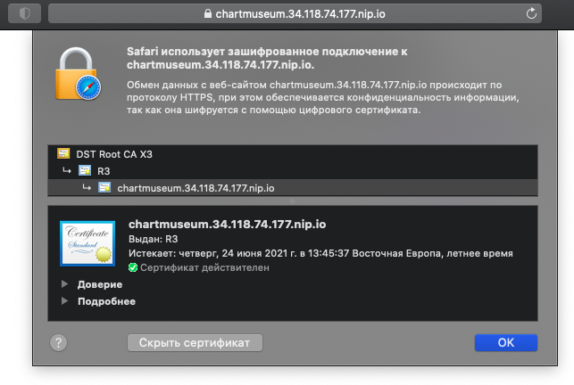

# pitnub_platform
pitnub Platform repository

## Оглавление
### [ДЗ Kubernetes-intro](#kubernetes-intro)
### [ДЗ Kubernetes-controllers](#kubernetes-controllers)
### [ДЗ Kubernetes-security](#kubernetes-security)
### [ДЗ Kubernetes-networks](#kubernetes-networks)
### [ДЗ Kubernetes-volumes](#kubernetes-volumes)
### [ДЗ Kubernetes-templating](#kubernetes-templating)

# Kubernetes-intro
1. Установил bash-completion: brew install bash-completion
2. Установил kubectl: brew install kubectl
3. Установил minikube: brew install minikube
4. Запуск minikube: minikube start
5. Установка dashboard: minikube dashboard
6. Установил консольный вариант dashboard k9s: brew install k9s
7. Опыты по удалению контейнеров:  
   $ minikube ssh  
   $ docker rm -f $(docker ps -a -q)  
   Если удалить все контейнеры - кластер самовосстановится.  
   Это удобно видеть в консоли k9s

   Еще одна проверка на прочность - удаление всех подов в системном namespace:  
   $ kubectl delete pods --all -n kube-system  
   Также удобно наблюдать за процессом восстановления в k9s

   Основной мастер-набор pod-ов контролируется Kubelet Node, в то время как другие (core-dns) управляются контроллером Репликации ReplicaSet.  
   Проверить это можно анализируя значение параметра "Controlled By:" в выводе команды: kubectl describe pods -n kube-system

Для выполнения домашней работы необходимо создать Dockerfile, в котором будет описан образ:
- Запускающий web-сервер на порту 8000
- Отдающий содержимое директории /app внутри контейнера
- Работающий с UID 1001

Для работы с докером установил Docker Desktop.

Создаем и переходим в ветку kubernetes-intro:
<pre>
git checkout -b kubernetes-intro
mkdir -p kubernetes-intro/web
cd web; vim Dockerfile

FROM nginx:alpine
LABEL maintainer="pitnub"
ARG nginx_uid=1001
ARG nginx_gid=1001
WORKDIR /app
EXPOSE 8000
RUN apk add shadow && usermod -u $nginx_uid -o nginx && groupmod -g $nginx_gid -o nginx \
 && sed -i '/listen/s/80;/8000;/' /etc/nginx/conf.d/default.conf \
 && sed -i '1,/root/s/\/usr\/share\/nginx\/html;/\/app;/' /etc/nginx/conf.d/default.conf
CMD ["nginx", "-g", "daemon off;"]
</pre>

Создаем образ:  
$ docker build -t pitnub/web:0.1 .

Отправил образ в docker-hub используя меню в Docker Desktop.

Создание первого манифеста:
<pre>
vim web-pod.yaml
apiVersion: v1
kind: Pod
metadata:
  name: web
  labels:
    app: web
spec:
  containers:
  - name: web
    image: pitnub/web:0.1
</pre>

Запуск пода:
<pre>
kubectl apply -f web-pod.yaml
pod/web created
kubectl get pods
NAME   READY   STATUS    RESTARTS   AGE
web    1/1     Running   0          4m19s
</pre>

Получение манифеста запущенного пода:  
kubectl get pod web -o yaml
  
Другой способ посмотреть описание pod - использовать ключ describe.  
Команда позволяет отследить текущее состояние объекта, а также события, которые с ним происходили.
<pre>
kubectl describe pod web

Name:         web
Namespace:    default
Priority:     0
Node:         minikube/192.168.99.100
Start Time:   Mon, 25 Jan 2021 23:14:09 +0200
Labels:       app=web
Annotations:  
Status:       Running
IP:           172.17.0.5
IPs:
  IP:  172.17.0.5
Containers:
  web:
    Container ID:   docker://2c1cd8015cfc37387dc2654339a69cbe65a5b0e951699f130a806a77038cb5f6
    Image:          pitnub/web:0.1
    Image ID:       docker-pullable://pitnub/web@sha256:6164840e83db0cda6217a347a8401ef36848646c71e5ea9b92c61df20cf7cca4
    Port:           
    Host Port:      
    State:          Running
      Started:      Mon, 25 Jan 2021 23:14:16 +0200
    Ready:          True
    Restart Count:  0
    Environment:    
    Mounts:
      /var/run/secrets/kubernetes.io/serviceaccount from default-token-vlgm7 (ro)
Conditions:
  Type              Status
  Initialized       True 
  Ready             True 
  ContainersReady   True 
  PodScheduled      True 
Volumes:
  default-token-vlgm7:
    Type:        Secret (a volume populated by a Secret)
    SecretName:  default-token-vlgm7
    Optional:    false
QoS Class:       BestEffort
Node-Selectors:  
Tolerations:     node.kubernetes.io/not-ready:NoExecute op=Exists for 300s
                 node.kubernetes.io/unreachable:NoExecute op=Exists for 300s
Events:
  Type    Reason     Age   From               Message
  ----    ------     ----  ----               -------
  Normal  Scheduled  15m   default-scheduler  Successfully assigned default/web to minikube
  Normal  Pulling    15m   kubelet            Pulling image "pitnub/web:0.1"
  Normal  Pulled     15m   kubelet            Successfully pulled image "pitnub/web:0.1" in 6.122254288s
  Normal  Created    15m   kubelet            Created container web
  Normal  Started    15m   kubelet            Started container web
</pre>

Добавление init-контейнера в наш pod, генерирующий страницу index.html.
<pre>
apiVersion: v1
kind: Pod
metadata:
  name: web
  labels:
    app: web
spec:
  containers:
  - name: web
    image: pitnub/web:0.1
    volumeMounts:
    - name: app
      mountPath: /app
  initContainers:
  - name: init-data
    image: busybox:1.32.1
    command: ['sh', '-c', 'wget -O- https://tinyurl.com/otus-k8s-intro | sh']
    volumeMounts:
    - name: app
      mountPath: /app
  volumes:
  - name: app
    emptyDir: {}

kubectl delete pod web
kubectl apply -f web-pod.yaml
kubectl get pods -w
NAME   READY   STATUS     RESTARTS   AGE
web    0/1     Init:0/1   0          5s
web    0/1     Init:0/1   0          5s
web    0/1     PodInitializing   0          6s
web    1/1     Running           0          7s
</pre>

Проверка работоспособности web сервера.  
Мы воспользуемся командой kubectl port-forward
Если все выполнено правильно, на локальном компьютере по ссылке http://localhost:8000/index.html должна открыться страница.

kubectl port-forward --address localhost pod/web 8000:8000

В последующих домашних заданиях мы будем использовать микросервисное приложение https://github.com/GoogleCloudPlatform/microservices-demo  
Давайте познакомимся с приложением поближе и попробуем запустить внутри нашего кластера его компоненты.

Начнем с микросервиса frontend.
<pre>
git clone git@github.com:GoogleCloudPlatform/microservices-demo.git
cd microservices-demo/src/frontend
docker build -t pitnub/boutique-frontend:v0.0.1 .
docker push pitnub/boutique-frontend:v0.0.1
</pre>

Альтернативный способ запуска pod в нашем Kubernetes кластере:  
kubectl run frontend --image pitnub/boutique-frontend:v0.0.1 --restart=Never

Генерация манифеста средствами kubectl:  
kubectl run frontend --image pitnub/boutique-frontend:v0.0.1 --restart=Never --dry-run=client -o yaml > frontend-pod.yaml

Запущенный pod frontend находится в состоянии Error.  
Смотрим журнал:
<pre>
$ kubectl logs frontend
{"message":"Tracing enabled.","severity":"info","timestamp":"2021-01-29T17:17:50.135604049Z"}
{"message":"Profiling enabled.","severity":"info","timestamp":"2021-01-29T17:17:50.135697858Z"}
panic: environment variable "PRODUCT_CATALOG_SERVICE_ADDR" not set

goroutine 1 [running]:
main.mustMapEnv(0xc000366000, 0xb1d189, 0x1c)
	/src/main.go:259 +0x10b
main.main()
	/src/main.go:117 +0x510
</pre>

Удаляем pod frontend:  
$ kubectl delete pods frontend

Добавляем определения требуемых переменных в файл frontend-pod-healhy.yaml  
Переменные найдены по ссылке https://github.com/GoogleCloudPlatform/microservices-demo/blob/master/kubernetes-manifests/frontend.yaml
<pre>
apiVersion: v1
kind: Pod
metadata:
  creationTimestamp: null
  labels:
    run: frontend
  name: frontend
spec:
  containers:
  - image: pitnub/boutique-frontend:v0.0.1
    name: frontend
    env:
    - name: PRODUCT_CATALOG_SERVICE_ADDR
      value: "productcatalogservice:3550"
    - name: CURRENCY_SERVICE_ADDR
      value: "currencyservice:7000"
    - name: CART_SERVICE_ADDR
      value: "cartservice:7070"
    - name: RECOMMENDATION_SERVICE_ADDR
      value: "recommendationservice:8080"
    - name: SHIPPING_SERVICE_ADDR
      value: "shippingservice:50051"
    - name: CHECKOUT_SERVICE_ADDR
      value: "checkoutservice:5050"
    - name: AD_SERVICE_ADDR
      value: "adservice:9555"
    resources: {}
  dnsPolicy: ClusterFirst
  restartPolicy: Never
status: {}
</pre>

Запускаем pod:  
$ kubectl apply -f frontend-pod-healthy.yaml

# Kubernetes-controllers

Установка KIND.
<pre>
$ brew install kind
$ kind version
kind v0.9.0 go1.15.2 darwin/amd64
</pre>

Будем использовать следующую конфигурацию нашего локального кластера - kind-config.yaml:

<pre>
kind: Cluster
apiVersion: kind.x-k8s.io/v1alpha4
nodes:
- role: control-plane
- role: control-plane
- role: control-plane
- role: worker
- role: worker
- role: worker
</pre>

Cоздание кластера kind:
<pre>
$ kind create cluster --config kind-config.yaml
$ kubectl cluster-info --context kind-kind
Kubernetes control plane is running at https://127.0.0.1:57462
KubeDNS is running at https://127.0.0.1:57462/api/v1/namespaces/kube-system/services/kube-dns:dns/proxy
</pre>

Развернуто три master ноды и три worker ноды:
<pre>
$ kubectl get nodes
NAME                  STATUS   ROLES    AGE     VERSION
kind-control-plane    Ready    master   5m47s   v1.19.1
kind-control-plane2   Ready    master   4m47s   v1.19.1
kind-control-plane3   Ready    master   3m35s   v1.19.1
kind-worker           Ready    none     3m13s   v1.19.1
kind-worker2          Ready    none     3m12s   v1.19.1
kind-worker3          Ready    none     3m12s   v1.19.1
</pre>

В предыдущем домашнем задании мы запускали standalone pod с микросервисом frontend.  
Пришло время доверить управление pod'ами данного микросервиса одному из контроллеров Kubernetes.  
Начнем с ReplicaSet и запустим одну реплику микросервиса frontend.  
Создайте и примените манифест frontend-replicaset.yaml  
Не забудьте изменить образ на собранный в предущем ДЗ.  

<pre>
apiVersion: apps/v1
kind: ReplicaSet
metadata:
  name: frontend
  labels:
    app: frontend
spec:
  replicas: 1
  template:
    metadata:
      labels:
        app: frontend
    spec:
      containers:
      - name: server
        image: pitnub/boutique-frontend:v0.0.1

$ kubectl apply -f frontend-replicaset.yaml
error: error validating "frontend-replicaset.yaml": 
 error validating data: ValidationError(ReplicaSet.spec): missing required field "selector" 
 in io.k8s.api.apps.v1.ReplicaSetSpec; if you choose to ignore these errors, 
 turn validation off with --validate=false
</pre>

Как можно понять из появившейся ошибки - в описании ReplicaSet не хватает важной секции  
Определите, что необходимо добавить в манифест, исправьте его и примените вновь.  
Не забудьте про то, что без указания environment переменных сервис не заработает  
В результате вывод команды kubectl get pods -l app=frontend должен показывать,  
что запущена одна реплика микросервиса frontend:  

<pre>
apiVersion: apps/v1
kind: ReplicaSet
metadata:
  name: frontend
  labels:
    app: frontend
spec:
  replicas: 1
  selector:
    matchLabels:
      app: frontend
  template:
    metadata:
      labels:
        app: frontend
    spec:
      containers:
      - name: server
        image: pitnub/boutique-frontend:v0.0.1
        env:
        - name: PRODUCT_CATALOG_SERVICE_ADDR
          value: "productcatalogservice:3550"
        - name: CURRENCY_SERVICE_ADDR
          value: "currencyservice:7000"
        - name: CART_SERVICE_ADDR
          value: "cartservice:7070"
        - name: RECOMMENDATION_SERVICE_ADDR
          value: "recommendationservice:8080"
        - name: SHIPPING_SERVICE_ADDR
          value: "shippingservice:50051"
        - name: CHECKOUT_SERVICE_ADDR
          value: "checkoutservice:5050"
        - name: AD_SERVICE_ADDR
          value: "adservice:9555"

$ kubectl apply -f frontend-replicaset.yaml
replicaset.apps/frontend created

$ kubectl get pods -l app=frontend
NAME             READY   STATUS    RESTARTS   AGE
frontend-j7jpr   1/1     Running   0          77s
</pre>

Одна работающая реплика - это уже неплохо, но в реальной жизни, как правило,  
требуется создание нескольких инстансов одного и того же сервиса для:  
 - Повышения отказоустойчивости  
 - Распределения нагрузки между репликами  
Давайте попробуем увеличить количество реплик сервиса adhoc командой:  
<pre>
$ kubectl scale replicaset frontend --replicas=3
replicaset.apps/frontend scaled
</pre>
<pre>
$ kubectl get pods -l app=frontend
NAME             READY   STATUS    RESTARTS   AGE
frontend-5kjn7   1/1     Running   0          21s
frontend-gh469   1/1     Running   0          21s
frontend-j7jpr   1/1     Running   0          3m16s
</pre>

Проверить, что ReplicaSet контроллер теперь управляет тремя репликами,  
и они готовы к работе, можно следующим образом:  
<pre>
$ kubectl get rs frontend
NAME       DESIRED   CURRENT   READY   AGE
frontend   3         3         3       4m31s
</pre>

Проверим, что благодаря контроллеру pod'ы действительно восстанавливаются после их ручного удаления:  
<pre>
$ kubectl delete pods -l app=frontend | kubectl get pods -l app=frontend -w
NAME             READY   STATUS    RESTARTS   AGE
frontend-5kjn7   1/1     Running   0          2m30s
frontend-gh469   1/1     Running   0          2m30s
frontend-j7jpr   1/1     Running   0          5m25s
frontend-5kjn7   1/1     Terminating   0          2m34s
frontend-9tfmx   0/1     Pending       0          0s
frontend-gh469   1/1     Terminating   0          2m35s
frontend-9tfmx   0/1     Pending       0          0s
frontend-j7jpr   1/1     Terminating   0          5m30s
frontend-sxx2d   0/1     Pending       0          0s
frontend-sxx2d   0/1     Pending       0          0s
frontend-9tfmx   0/1     ContainerCreating   0          0s
frontend-zsllz   0/1     Pending             0          1s
frontend-sxx2d   0/1     ContainerCreating   0          1s
frontend-zsllz   0/1     Pending             0          1s
frontend-gh469   0/1     Terminating         0          2m36s
frontend-5kjn7   0/1     Terminating         0          2m36s
frontend-zsllz   0/1     ContainerCreating   0          1s
frontend-j7jpr   0/1     Terminating         0          5m32s
frontend-5kjn7   0/1     Terminating         0          2m37s
frontend-5kjn7   0/1     Terminating         0          2m37s
frontend-9tfmx   1/1     Running             0          3s
frontend-sxx2d   1/1     Running             0          3s
frontend-j7jpr   0/1     Terminating         0          5m33s
frontend-j7jpr   0/1     Terminating         0          5m33s
frontend-zsllz   1/1     Running             0          4s
frontend-gh469   0/1     Terminating         0          2m47s
frontend-gh469   0/1     Terminating         0          2m47s
</pre>

Повторно примените манифест frontend-replicaset.yaml  
Убедитесь, что количество реплик вновь уменьшилось до одной.  
Измените манифест таким образом, чтобы из манифеста сразу разворачивалось три реплики сервиса, вновь примените его.  
<pre>
$ kubectl apply -f frontend-replicaset.yaml
replicaset.apps/frontend configured
$ kubectl get pods -l app=frontend
NAME             READY   STATUS    RESTARTS   AGE
frontend-sxx2d   1/1     Running   0          5m10s
$ kubectl get rs frontend
NAME       DESIRED   CURRENT   READY   AGE
frontend   1         1         1       11m

$ kubectl apply -f frontend-replicaset.yaml
replicaset.apps/frontend configured
$ kubectl get rs frontend
NAME       DESIRED   CURRENT   READY   AGE
frontend   3         3         3       12m
$ kubectl get pods -l app=frontend
NAME             READY   STATUS    RESTARTS   AGE
frontend-gzwvt   1/1     Running   0          10s
frontend-sxx2d   1/1     Running   0          6m58s
frontend-wscvm   1/1     Running   0          10s
</pre>

Давайте представим, что мы обновили исходный код и хотим выкатить новую версию микросервиса  
Добавьте на DockerHub версию образа с новым тегом (v0.0.2, можно просто перетегировать старый образ)  
<pre>
$ docker images
REPOSITORY                 TAG                  IMAGE ID       CREATED        SIZE
pitnub/boutique-frontend   v0.0.1               374e121a6262   3 weeks ago    41.1MB
$ docker tag 374e121a6262 pitnub/boutique-frontend:v0.0.2
$ docker images
REPOSITORY                 TAG                  IMAGE ID       CREATED        SIZE
pitnub/boutique-frontend   v0.0.1               374e121a6262   3 weeks ago    41.1MB
pitnub/boutique-frontend   v0.0.2               374e121a6262   3 weeks ago    41.1MB

$ docker push pitnub/boutique-frontend:v0.0.2
</pre>
Обновите в манифесте версию образа  
Примените новый манифест, параллельно запустите отслеживание происходящего:  
<pre>
$ kubectl apply -f frontend-replicaset.yaml | kubectl get pods -l app=frontend -w
NAME             READY   STATUS    RESTARTS   AGE
frontend-gzwvt   1/1     Running   0          45m
frontend-sxx2d   1/1     Running   0          51m
frontend-wscvm   1/1     Running   0          45m
</pre>
Кажется, ничего не произошло  

Давайте проверим образ, указанный в ReplicaSet:  
<pre>
$ kubectl get replicaset frontend -o=jsonpath='{.spec.template.spec.containers[0].image}'
pitnub/boutique-frontend:v0.0.2
</pre>
И образ из которого сейчас запущены pod, управляемые контроллером:  
<pre>
$ kubectl get pods -l app=frontend -o=jsonpath='{.items[0:3].spec.containers[0].image}'
pitnub/boutique-frontend:v0.0.1 pitnub/boutique-frontend:v0.0.1 pitnub/boutique-frontend:v0.0.1
</pre>

Удалите все запущенные pod и после их пересоздания еще раз проверьте, из какого образа они развернулись:  
<pre>
$ kubectl delete pods -l app=frontend
$ kubectl get pods -l app=frontend -o=jsonpath='{.items[0:3].spec.containers[0].image}'
pitnub/boutique-frontend:v0.0.2 pitnub/boutique-frontend:v0.0.2 pitnub/boutique-frontend:v0.0.2
</pre>

Руководствуясь материалами лекции опишите произошедшую ситуацию, почему обновление ReplicaSet
не повлекло обновление запущенных pod ?  
Потому что задача этого контроллера обеспечить работу требуемого числа экземпляров приложения - а в нашем случае все экземпляры доступны.  

<pre>
git checkout -b kubernetes-controllers
mkdir kubernetes-controllers
cp frontend-replicaset.yaml kubernetes-controllers
</pre>

Мы, тем временем, перейдем к следующему контроллеру, более подходящему для развертывания и обновления приложений внутри Kubernetes.  
Для начала - воспроизведите действия, проделанные с микросервисом frontend для микросервиса paymentService.  
Результат:  
 - Собранный и помещенный в Docker Hub образ с двумя тегами v0.0.1 и v0.0.2
 - Валидный манифест paymentservice-replicaset.yaml с тремя репликами, разворачивающими из образа версии v0.0.1

<pre>
cd microservices-demo/src/paymentservice
$ docker build -t pitnub/boutique-paymentservice:v0.0.1 .
$ docker push pitnub/boutique-paymentservice:v0.0.1
</pre>

Получение манифеста пода в рабочем режиме:  
<pre>
$ kubectl run paymentservice --image pitnub/boutique-paymentservice:v0.0.1 --restart=Never
pod/paymentservice created
$ kubectl get pod paymentservice -o yaml > paymentservice-pod-active.yaml
$ kubectl delete pods paymentservice
pod "paymentservice" deleted
</pre>
Получение манифеста пода в холостом режиме:  
<pre>
$ kubectl run paymentservice --image pitnub/boutique-paymentservice:v0.0.1 --restart=Never --dry-run=client -o yaml > paymentservice-pod.yaml
</pre>
Запускаем pod:  
<pre>
$ kubectl apply -f paymentservice-pod.yaml
pod/paymentservice created
</pre>
Создаем манифест paymentservice-replicaset.yaml контроллера Replicaset c 3 репликами пода paymentservice:
<pre>
$ kubectl apply -f paymentservice-replicaset.yaml | kubectl get pods -l app=paymentservice -w
NAME                   READY   STATUS    RESTARTS   AGE
paymentservice-zh52n   0/1     Pending   0          0s
paymentservice-zh52n   0/1     Pending   0          0s
paymentservice-lhjqh   0/1     Pending   0          0s
paymentservice-8d66b   0/1     Pending   0          0s
paymentservice-lhjqh   0/1     Pending   0          1s
paymentservice-8d66b   0/1     Pending   0          1s
paymentservice-zh52n   0/1     ContainerCreating   0          1s
paymentservice-lhjqh   0/1     ContainerCreating   0          1s
paymentservice-8d66b   0/1     ContainerCreating   0          1s
paymentservice-zh52n   1/1     Running             0          3s
paymentservice-8d66b   1/1     Running             0          4s
paymentservice-lhjqh   1/1     Running             0          52s

$ docker images
REPOSITORY                       TAG                  IMAGE ID       CREATED        SIZE
pitnub/boutique-paymentservice   v0.0.1               5c9b35ce54b2   13 hours ago   323MB
$ docker tag 5c9b35ce54b2 pitnub/boutique-paymentservice:v0.0.2
$ docker images
REPOSITORY                       TAG                  IMAGE ID       CREATED        SIZE
pitnub/boutique-paymentservice   v0.0.1               5c9b35ce54b2   13 hours ago   323MB
pitnub/boutique-paymentservice   v0.0.2               5c9b35ce54b2   13 hours ago   323MB
$ docker push pitnub/boutique-paymentservice:v0.0.2

$ kubectl get rs,pod
NAME                             DESIRED   CURRENT   READY   AGE
replicaset.apps/paymentservice   3         3         3       10m

NAME                       READY   STATUS    RESTARTS   AGE
pod/paymentservice-8d66b   1/1     Running   0          10m
pod/paymentservice-lhjqh   1/1     Running   0          10m
pod/paymentservice-zh52n   1/1     Running   0          10m
</pre>

Удаляем контроллер (и соответственно поды):
<pre>
$ kubectl delete rs -l app=paymentservice
replicaset.apps "paymentservice" deleted
</pre>

Приступим к написанию Deployment манифеста для сервиса payment  
Скопируйте содержимое файла paymentservicereplicaset.yaml в файл paymentservice-deployment.yaml  
Измените поле kind с ReplicaSet на Deployment  
Манифест готов. Примените его и убедитесь, что в кластере Kubernetes  
действительно запустилось три реплики сервиса payment и каждая из них находится в состоянии Ready  
Обратите внимание, что помимо Deployment (kubectl get deployments) и трех pod,  
у нас появился новый ReplicaSet (kubectl get rs)  

<pre>
$ kubectl apply -f paymentservice-deployment.yaml | kubectl get pods -l app=paymentservice -w
NAME                              READY   STATUS    RESTARTS   AGE
paymentservice-77c59c696b-2d9qd   0/1     Pending   0          0s
paymentservice-77c59c696b-xj9zs   0/1     Pending   0          0s
paymentservice-77c59c696b-2d9qd   0/1     Pending   0          0s
paymentservice-77c59c696b-r6nt6   0/1     Pending   0          0s
paymentservice-77c59c696b-xj9zs   0/1     Pending   0          0s
paymentservice-77c59c696b-xj9zs   0/1     ContainerCreating   0          0s
paymentservice-77c59c696b-r6nt6   0/1     Pending             0          0s
paymentservice-77c59c696b-2d9qd   0/1     ContainerCreating   0          1s
paymentservice-77c59c696b-r6nt6   0/1     ContainerCreating   0          1s
paymentservice-77c59c696b-2d9qd   1/1     Running             0          3s
paymentservice-77c59c696b-r6nt6   1/1     Running             0          5s
paymentservice-77c59c696b-xj9zs   1/1     Running             0          8s

$ kubectl get rs,pod,deployment -l app=paymentservice
NAME                                        DESIRED   CURRENT   READY   AGE
replicaset.apps/paymentservice-77c59c696b   3         3         3       74s

NAME                                  READY   STATUS    RESTARTS   AGE
pod/paymentservice-77c59c696b-2d9qd   1/1     Running   0          74s
pod/paymentservice-77c59c696b-r6nt6   1/1     Running   0          74s
pod/paymentservice-77c59c696b-xj9zs   1/1     Running   0          74s

NAME                             READY   UP-TO-DATE   AVAILABLE   AGE
deployment.apps/paymentservice   3/3     3            3           74s
</pre>

Давайте попробуем обновить наш Deployment на версию образа v0.0.2  

<pre>
$ kubectl apply -f paymentservice-deployment.yaml | kubectl get pods -l app=paymentservice -w
NAME                              READY   STATUS    RESTARTS   AGE
paymentservice-77c59c696b-2d9qd   1/1     Running   0          11m
paymentservice-77c59c696b-r6nt6   1/1     Running   0          11m
paymentservice-77c59c696b-xj9zs   1/1     Running   0          11m
paymentservice-74b785f7c9-djmn8   0/1     Pending   0          0s
paymentservice-74b785f7c9-djmn8   0/1     Pending   0          0s
paymentservice-74b785f7c9-djmn8   0/1     ContainerCreating   0          0s
paymentservice-74b785f7c9-djmn8   1/1     Running             0          4s
paymentservice-77c59c696b-2d9qd   1/1     Terminating         0          11m
paymentservice-74b785f7c9-p7kdn   0/1     Pending             0          1s
paymentservice-74b785f7c9-p7kdn   0/1     Pending             0          1s
paymentservice-74b785f7c9-p7kdn   0/1     ContainerCreating   0          2s
paymentservice-74b785f7c9-p7kdn   1/1     Running             0          5s
paymentservice-77c59c696b-xj9zs   1/1     Terminating         0          11m
paymentservice-74b785f7c9-b7vrx   0/1     Pending             0          0s
paymentservice-74b785f7c9-b7vrx   0/1     Pending             0          0s
paymentservice-74b785f7c9-b7vrx   0/1     ContainerCreating   0          1s
paymentservice-74b785f7c9-b7vrx   1/1     Running             0          4s
paymentservice-77c59c696b-r6nt6   1/1     Terminating         0          11m
paymentservice-77c59c696b-2d9qd   0/1     Terminating         0          11m
paymentservice-77c59c696b-2d9qd   0/1     Terminating         0          11m
paymentservice-77c59c696b-2d9qd   0/1     Terminating         0          11m
paymentservice-77c59c696b-xj9zs   0/1     Terminating         0          11m
paymentservice-77c59c696b-xj9zs   0/1     Terminating         0          11m
paymentservice-77c59c696b-xj9zs   0/1     Terminating         0          11m
paymentservice-77c59c696b-r6nt6   0/1     Terminating         0          11m
paymentservice-77c59c696b-r6nt6   0/1     Terminating         0          12m
paymentservice-77c59c696b-r6nt6   0/1     Terminating         0          12m
</pre>

Обратите внимание на последовательность обновления pod.  
По умолчанию применяется стратегия Rolling Update:  
 - Создание одного нового pod с версией образа v0.0.2
 - Удаление одного из старых pod
 - Создание еще одного нового pod
   ...

Убедитесь что:  
 - Все новые pod развернуты из образа v0.0.2
   <pre>
   $ kubectl get pods -l app=paymentservice -o=jsonpath='{.items[0:3].spec.containers[0].image}'
   pitnub/boutique-paymentservice:v0.0.2 pitnub/boutique-paymentservice:v0.0.2 pitnub/boutique-paymentservice:v0.0.2
   </pre>
 - Создано два ReplicaSet:  
   - Один (новый) управляет тремя репликами pod с образом v0.0.2
   <pre>
   $ kubectl get rs -l app=paymentservice
   NAME                                        DESIRED   CURRENT   READY   AGE
   replicaset.apps/paymentservice-74b785f7c9   3         3         3       12m
   replicaset.apps/paymentservice-77c59c696b   0         0         0       23m
   $ kubectl get replicaset paymentservice-74b785f7c9 -o=jsonpath='{.spec.template.spec.containers[0].image}'
     pitnub/boutique-paymentservice:v0.0.2
   - Второй (старый) управляет нулем реплик pod с образом v0.0.1
   $ kubectl get replicaset paymentservice-77c59c696b -o=jsonpath='{.spec.template.spec.containers[0].image}'
     pitnub/boutique-paymentservice:v0.0.1
   </pre>

Также мы можем посмотреть на историю версий нашего Deployment:  
<pre>
$ kubectl rollout history deployment paymentservice
deployment.apps/paymentservice 
REVISION  CHANGE-CAUSE
1         none
2         none
</pre>

Представим, что обновление по каким-то причинам произошло неудачно и нам необходимо сделать откат.  
Kubernetes предоставляет такую возможность:  
<pre>
$ kubectl rollout undo deployment paymentservice --to-revision=1 | kubectl get rs -l app=paymentservice -w
</pre>
В выводе мы можем наблюдать, как происходит постепенное масштабирование вниз "нового" ReplicaSet, 
и масштабирование вверх "старого"  

<pre>
NAME                        DESIRED   CURRENT   READY   AGE
paymentservice-74b785f7c9   3         3         3       18m
paymentservice-77c59c696b   0         0         0       29m
paymentservice-77c59c696b   0         0         0       29m
paymentservice-77c59c696b   1         0         0       29m
paymentservice-77c59c696b   1         0         0       29m
paymentservice-77c59c696b   1         1         0       29m
paymentservice-77c59c696b   1         1         1       29m
paymentservice-74b785f7c9   2         3         3       18m
paymentservice-77c59c696b   2         1         1       29m
paymentservice-74b785f7c9   2         3         3       18m
paymentservice-74b785f7c9   2         2         2       18m
paymentservice-77c59c696b   2         1         1       29m
paymentservice-77c59c696b   2         2         1       29m
paymentservice-77c59c696b   2         2         2       29m
paymentservice-74b785f7c9   1         2         2       18m
paymentservice-74b785f7c9   1         2         2       18m
paymentservice-77c59c696b   3         2         2       29m
paymentservice-74b785f7c9   1         1         1       18m
paymentservice-77c59c696b   3         2         2       30m
paymentservice-77c59c696b   3         3         2       30m
paymentservice-77c59c696b   3         3         3       30m
paymentservice-74b785f7c9   0         1         1       18m
paymentservice-74b785f7c9   0         1         1       18m
paymentservice-74b785f7c9   0         0         0       18m
</pre>

С использованием параметров maxSurge и maxUnavailable 
самостоятельно реализуйте два следующих сценария развертывания:
 - Аналог blue-green:
   1. Развертывание трех новых pod
   2. Удаление трех старых pod
 - Reverse Rolling Update:
   1. Удаление одного старого pod
   2. Создание одного нового pod
   3. ...

Документация с описанием стратегий развертывания для Deployment
https://kubernetes.io/docs/concepts/workloads/controllers/deployment/#strategy
В результате должно получиться два манифеста:
 - paymentservice-deployment-bg.yaml
 - paymentservice-deployment-reverse.yaml

Аналог blue-green:
<pre>
apiVersion: apps/v1
kind: Deployment
metadata:
  name: paymentservice
  labels:
    app: paymentservice
spec:
  replicas: 3
  strategy:
    type: RollingUpdate
    rollingUpdate:
      maxSurge: 100%
      maxUnavailable: 0
  selector:
    matchLabels:
      app: paymentservice
  template:
    metadata:
      labels:
        app: paymentservice
    spec:
      containers:
      - name: paymentservice
        image: pitnub/boutique-paymentservice:v0.0.1

$ kubectl delete deploy -l app=paymentservice
deployment.apps "paymentservice" deleted

$ kubectl apply -f paymentservice-deployment-bg.yaml | kubectl get pods -l app=paymentservice -w
NAME                              READY   STATUS    RESTARTS   AGE
paymentservice-77c59c696b-xdj6s   0/1     Pending   0          0s
paymentservice-77c59c696b-ddx4f   0/1     Pending   0          0s
paymentservice-77c59c696b-244dl   0/1     Pending   0          0s
paymentservice-77c59c696b-xdj6s   0/1     Pending   0          0s
paymentservice-77c59c696b-ddx4f   0/1     Pending   0          0s
paymentservice-77c59c696b-244dl   0/1     Pending   0          0s
paymentservice-77c59c696b-xdj6s   0/1     ContainerCreating   0          1s
paymentservice-77c59c696b-ddx4f   0/1     ContainerCreating   0          1s
paymentservice-77c59c696b-244dl   0/1     ContainerCreating   0          1s
paymentservice-77c59c696b-ddx4f   1/1     Running             0          4s
paymentservice-77c59c696b-xdj6s   1/1     Running             0          6s
paymentservice-77c59c696b-244dl   1/1     Running             0          6s

$ kubectl rollout status deployment paymentservice
deployment "paymentservice" successfully rolled out

$ kubectl describe deployment paymentservice
Name:                   paymentservice
Namespace:              default
CreationTimestamp:      Sun, 21 Feb 2021 17:20:03 +0200
Labels:                 app=paymentservice
Annotations:            deployment.kubernetes.io/revision: 1
Selector:               app=paymentservice
Replicas:               3 desired | 3 updated | 3 total | 3 available | 0 unavailable
StrategyType:           RollingUpdate
MinReadySeconds:        0
RollingUpdateStrategy:  0 max unavailable, 100% max surge
Pod Template:
  Labels:  app=paymentservice
  Containers:
   paymentservice:
    Image:        pitnub/boutique-paymentservice:v0.0.1
    Port:         none
    Host Port:    none
    Environment:  none
    Mounts:       none
  Volumes:        none
Conditions:
  Type           Status  Reason
  ----           ------  ------
  Available      True    MinimumReplicasAvailable
  Progressing    True    NewReplicaSetAvailable
OldReplicaSets:  none
NewReplicaSet:   paymentservice-77c59c696b (3/3 replicas created)
Events:
  Type    Reason             Age   From                   Message
  ----    ------             ----  ----                   -------
  Normal  ScalingReplicaSet  117s  deployment-controller  Scaled up replica set paymentservice-77c59c696b to 3
</pre>

Обновляем наш Deployment на версию образа v0.0.2  
$ kubectl apply -f paymentservice-deployment-bg.yaml  
Одновременно наблюдаем за развертыванием подов в k9s.  
Когда новые три пода будут запущены запускаем команду постановки на паузу нашего deployment:  
$ kubectl rollout pause deployment paymentservice  
Примечание: лично у меня не получилось вовремя запаузить - старые поды все равно удалились...  
$ kubectl rollout resume deployment paymentservice  

Reverse Rolling Update: 

<pre>
apiVersion: apps/v1
kind: Deployment
metadata:
  name: paymentservice
  labels:
    app: paymentservice
spec:
  replicas: 3
  strategy:
    type: RollingUpdate
    rollingUpdate:
      maxSurge: 0
      maxUnavailable: 1
  selector:
    matchLabels:
      app: paymentservice
  template:
    metadata:
      labels:
        app: paymentservice
    spec:
      containers:
      - name: paymentservice
        image: pitnub/boutique-paymentservice:v0.0.1

$ kubectl apply -f paymentservice-deployment-reverse.yaml
deployment.apps/paymentservice created

Меняем образ на v0.0.2
$ kubectl apply -f paymentservice-deployment-reverse.yaml | kubectl get pods -l app=paymentservice -w
NAME                              READY   STATUS    RESTARTS   AGE
paymentservice-77c59c696b-dz8hb   1/1     Running   0          3m47s
paymentservice-77c59c696b-np9v4   1/1     Running   0          3m46s
paymentservice-77c59c696b-vl627   1/1     Running   0          3m46s
paymentservice-77c59c696b-vl627   1/1     Terminating   0          3m47s
paymentservice-74b785f7c9-t2hgp   0/1     Pending       0          0s
paymentservice-74b785f7c9-t2hgp   0/1     Pending       0          0s
paymentservice-74b785f7c9-t2hgp   0/1     ContainerCreating   0          0s
paymentservice-74b785f7c9-t2hgp   1/1     Running             0          3s
paymentservice-77c59c696b-dz8hb   1/1     Terminating         0          3m51s
paymentservice-74b785f7c9-b69rx   0/1     Pending             0          0s
paymentservice-74b785f7c9-b69rx   0/1     Pending             0          0s
paymentservice-74b785f7c9-b69rx   0/1     ContainerCreating   0          0s
paymentservice-74b785f7c9-b69rx   1/1     Running             0          2s
paymentservice-77c59c696b-np9v4   1/1     Terminating         0          3m53s
paymentservice-74b785f7c9-fhggh   0/1     Pending             0          0s
paymentservice-74b785f7c9-fhggh   0/1     Pending             0          0s
paymentservice-74b785f7c9-fhggh   0/1     ContainerCreating   0          1s
paymentservice-74b785f7c9-fhggh   1/1     Running             0          3s
paymentservice-77c59c696b-vl627   0/1     Terminating         0          4m18s
paymentservice-77c59c696b-vl627   0/1     Terminating         0          4m20s
paymentservice-77c59c696b-vl627   0/1     Terminating         0          4m21s
paymentservice-77c59c696b-dz8hb   0/1     Terminating         0          4m22s
paymentservice-77c59c696b-np9v4   0/1     Terminating         0          4m25s
paymentservice-77c59c696b-np9v4   0/1     Terminating         0          4m30s
paymentservice-77c59c696b-np9v4   0/1     Terminating         0          4m30s
paymentservice-77c59c696b-dz8hb   0/1     Terminating         0          4m31s
paymentservice-77c59c696b-dz8hb   0/1     Terminating         0          4m32s
</pre>

Мы научились разворачивать и обновлять наши микросервисы, но можем ли быть уверены, что они корректно работают после выкатки?  
Один из механизмов Kubernetes, позволяющий нам проверить это probes  
https://kubernetes.io/docs/tasks/configure-pod-container/configure-liveness-readiness-startup-probes/  

Давайте на примере микросервиса frontend посмотрим на то, как probes влияют на процесс развертывания.  
 - Создайте манифест frontend-deployment.yaml из которого можно развернуть три реплики pod с тегом образа v0.0.1
 - Добавьте туда описание readinessProbe.
   Описание можно взять из манифеста по ссылке 
   https://github.com/GoogleCloudPlatform/microservices-demo/blob/master/kubernetes-manifests/frontend.yaml
   
Примените манифест с readinessProbe.  
Если все сделано правильно, то мы вновь увидим три запущенных pod в описании которых (kubectl describe pod)  
будет указание на наличие readinessProbe и ее параметры  

<pre>
apiVersion: apps/v1
kind: Deployment
metadata:
  name: frontend
  labels:
    app: frontend
spec:
  replicas: 3
  selector:
    matchLabels:
      app: frontend
  template:
    metadata:
      labels:
        app: frontend
    spec:
      containers:
      - name: server
        image: pitnub/boutique-frontend:v0.0.1
        readinessProbe:
          initialDelaySeconds: 10
          httpGet:
            path: "/_healthz"
            port: 8080
            httpHeaders:
            - name: "Cookie"
              value: "shop_session-id=x-readiness-probe"
        env:
        - name: PRODUCT_CATALOG_SERVICE_ADDR
          value: "productcatalogservice:3550"
        - name: CURRENCY_SERVICE_ADDR
          value: "currencyservice:7000"
        - name: CART_SERVICE_ADDR
          value: "cartservice:7070"
        - name: RECOMMENDATION_SERVICE_ADDR
          value: "recommendationservice:8080"
        - name: SHIPPING_SERVICE_ADDR
          value: "shippingservice:50051"
        - name: CHECKOUT_SERVICE_ADDR
          value: "checkoutservice:5050"
        - name: AD_SERVICE_ADDR
          value: "adservice:9555"

$ kubectl apply -f frontend-deployment.yaml | kubectl get pods -l app=frontend -w
NAME                        READY   STATUS    RESTARTS   AGE
frontend-6f957c7c56-jdcnh   0/1     Pending   0          0s
frontend-6f957c7c56-jdcnh   0/1     Pending   0          0s
frontend-6f957c7c56-dzrgt   0/1     Pending   0          0s
frontend-6f957c7c56-st6m9   0/1     Pending   0          0s
frontend-6f957c7c56-dzrgt   0/1     Pending   0          0s
frontend-6f957c7c56-st6m9   0/1     Pending   0          0s
frontend-6f957c7c56-dzrgt   0/1     ContainerCreating   0          0s
frontend-6f957c7c56-jdcnh   0/1     ContainerCreating   0          1s
frontend-6f957c7c56-st6m9   0/1     ContainerCreating   0          1s
frontend-6f957c7c56-st6m9   0/1     Running             0          18s
frontend-6f957c7c56-dzrgt   0/1     Running             0          19s
frontend-6f957c7c56-jdcnh   0/1     Running             0          20s
frontend-6f957c7c56-st6m9   1/1     Running             0          30s
frontend-6f957c7c56-dzrgt   1/1     Running             0          30s
frontend-6f957c7c56-jdcnh   1/1     Running             0          32s

$ kubectl describe pod frontend-6f957c7c56-jdcnh | grep Readiness:
    Readiness:      http-get http://:8080/_healthz delay=10s timeout=1s period=10s #success=1 #failure=3
</pre>

Давайте попробуем сымитировать некорректную работу приложения и посмотрим, как будет вести себя обновление:
 - Замените в описании пробы URL /_healthz на /_health
 - Разверните версию v0.0.2

<pre>
$ kubectl apply -f frontend-deployment.yaml | kubectl get pods -l app=frontend -w
NAME                        READY   STATUS    RESTARTS   AGE
frontend-6f957c7c56-dzrgt   1/1     Running   0          5m34s
frontend-6f957c7c56-jdcnh   1/1     Running   0          5m34s
frontend-6f957c7c56-st6m9   1/1     Running   0          5m34s
frontend-7879956c64-nlbvv   0/1     Pending   0          0s
frontend-7879956c64-nlbvv   0/1     Pending   0          0s
frontend-7879956c64-nlbvv   0/1     ContainerCreating   0          0s
frontend-7879956c64-nlbvv   0/1     Running             0          1s

$ kubectl describe pod frontend-7879956c64-nlbvv | grep Readiness
    Readiness:      http-get http://:8080/_health delay=10s timeout=1s period=10s #success=1 #failure=3
  Warning  Unhealthy  9s (x13 over 2m9s)  kubelet  Readiness probe failed: HTTP probe failed with statuscode: 404
</pre>

Как можно было заметить, пока readinessProbe для нового pod не станет успешной - 
Deployment не будет пытаться продолжить обновление.  
На данном этапе может возникнуть вопрос - как автоматически отследить успешность выполнения Deployment 
(например для запуска в CI/CD).  
В этом нам может помочь следующая команда:  
$ kubectl rollout status deployment/frontend  
Waiting for deployment "frontend" rollout to finish: 1 out of 3 new replicas have been updated...  

Таким образом описание pipeline, включающее в себя шаг развертывания и шаг отката,  
в самом простом случае может выглядеть так (синтаксис GitLab CI):  

<pre>
deploy_job:
  stage: deploy
  script:
    - kubectl apply -f frontend-deployment.yaml
    - kubectl rollout status deployment/frontend --timeout=60s

rollback_deploy_job:
  stage: rollback
  script:
    - kubectl rollout undo deployment/frontend
  when: on_failure
</pre>

Рассмотрим еще один контроллер Kubernetes.  
Отличительная особенность DaemonSet в том, что при его применении на каждом физическом хосте 
создается по одному экземпляру pod, описанного в спецификации.  
Типичные кейсы использования DaemonSet:  
 - Сетевые плагины
 - Утилиты для сбора и отправки логов (Fluent Bit, Fluentd, etc...)
 - Различные утилиты для мониторинга (Node Exporter, etc...)
 - ...

Опробуем DaemonSet на примере Node Exporter  
 - Найдите в интернете или напишите самостоятельно манифест node-exporter-daemonset.yaml 
   для развертывания DaemonSet с Node Exporter
 - После применения данного DaemonSet и выполнения команды:
   kubectl port-forward <имя любого pod в DaemonSet> 9100:9100 
   метрики должны быть доступны на localhost: curl localhost:9100/metrics

<pre>
- Добавляем namespace monitoring
  $ kubectl create namespace monitoring
- Комментируем сервисную учетную запись в спецификации подов
  #serviceAccountName: node-exporter
- Применяем манифест
  $ kubectl apply -f node-exporter-daemonset.yaml -n monitoring
  daemonset.apps/node-exporter created
- Проверяем описание Daemonset
  $ kubectl describe daemonset.apps/node-exporter -n monitoring
- Проверяем поды
  $ kubectl get pods -n monitoring     
  NAME                  READY   STATUS    RESTARTS   AGE
  node-exporter-5cwv5   2/2     Running   0          38m
  node-exporter-955sm   2/2     Running   0          38m
  node-exporter-bgqd8   2/2     Running   0          38m
  node-exporter-bkt87   2/2     Running   0          38m
  node-exporter-sbkc2   2/2     Running   0          38m
  node-exporter-xxlsz   2/2     Running   0          38m
- $ kubectl port-forward pod/node-exporter-bgqd8 9100:9100 -n monitoring
  Forwarding from 127.0.0.1:9100 -> 9100
  Forwarding from [::1]:9100 -> 9100

- Как правило, мониторинг требуется не только для worker, но и для master нод. 
  При этом, по умолчанию, pod управляемые DaemonSet на master нодах не разворачиваются
- Найдите способ модернизировать свой DaemonSet таким образом, 
  чтобы Node Exporter был развернут как на master, так и на worker нодах (конфигурацию самих нод изменять нельзя)
- Отразите изменения в манифесте

Как видно выше у нас поды развернуты на всех 6 нодах.
Это произошлоа из-за "вседозволенной настройки в блоке tolerations":
tolerations:
- operator: Exists
У мастер-нод стоит ключ с эффектом NoSchedule:
$ kubectl describe node kind-control-plane | grep Taints
Taints:   node-role.kubernetes.io/master:NoSchedule
Если мы наоборот захотим не использовать мастер-ноды - то можно просто убрать блок tolerations.
$ kubectl delete daemonset.apps/node-exporter -n monitoring
daemonset.apps "node-exporter" deleted
$ kubectl apply -f node-exporter-daemonset.yaml -n monitoring
daemonset.apps/node-exporter created
$ kubectl get pods -n monitoring
NAME                  READY   STATUS    RESTARTS   AGE
node-exporter-8mb9f   2/2     Running   0          61s
node-exporter-wglkv   2/2     Running   0          61s
node-exporter-wgzr7   2/2     Running   0          61s
</pre>

# Kubernetes-security
### task01
 - Создать Service Account bob, дать ему роль admin в рамках всего кластера  
   <pre>
   $ kubectl apply -f 01-ServiceAccount.yaml
   serviceaccount/bob created
   $ kubectl apply -f 02-ClusterRoleBinding.yaml
   clusterrolebinding.rbac.authorization.k8s.io/bob-admin created
   $ kubectl get clusterrolebinding
   NAME            ROLE                     AGE
   bob-admin       ClusterRole/admin        99s
   </pre>
 - Создать Service Account dave без доступа к кластеру  
   <pre>
   $ kubectl apply -f 03-ServiceAccount.yaml
   serviceaccount/dave created
   </pre>
   Без привязки к роли доступа у данной учетки к кластеру не будет.

### task02
 - Создать Namespace prometheus  
   $ kubectl apply -f 01-ns-prometheus.yaml  
   namespace/prometheus created
 - Создать Service Account carol в этом Namespace  
   $ kubectl apply -f 02-ServiceAccount.yaml -n prometheus  
   serviceaccount/carol created
 - Дать всем Service Account в Namespace prometheus возможность делать get, list, watch
   в отношении Pods всего кластера  
   <pre>
   $ kubectl apply -f 03-ClusterRole.yaml                 
   clusterrole.rbac.authorization.k8s.io/prometheus-pods-read created
   $ kubectl apply -f 04-ClusterRoleBinding.yaml
   clusterrolebinding.rbac.authorization.k8s.io/prometheus created
   </pre>
   
### task03
 - Создать Namespace dev  
   $ kubectl apply -f 01-ns-dev.yaml  
   namespace/dev created
 - Создать Service Account jane в Namespace dev  
   $ kubectl apply -f 02-ServiceAccount.yaml  
   serviceaccount/jane created
 - Дать jane роль admin в рамках Namespace dev  
   $ kubectl apply -f 03-RoleBinding.yaml   
   rolebinding.rbac.authorization.k8s.io/jane-admin created
 - Создать Service Account ken в Namespace dev  
   $ kubectl apply -f 04-ServiceAccount.yaml  
   serviceaccount/ken created
 - Дать ken роль view в рамках Namespace dev  
   $ kubectl apply -f 05-RoleBinding.yaml   
   rolebinding.rbac.authorization.k8s.io/ken-view created

# Kubernetes-networks

У меня установлен Docker for Desktop, поэтому HyperKit доступен:
<pre>
$ hyperkit -v
hyperkit: v0.20200224-44-gb54460
Homepage: https://github.com/docker/hyperkit
License: BSD
</pre>

Удаляем предыдущий кластер в minikube(virtualbox) и запускаем новый с драйвером hyperkit:
<pre>
$ minikube delete
$ minikube start --driver=hyperkit
</pre>

Работа с тестовым веб-приложением
 - Добавление проверок Pod  
Откройте файл с описанием Pod из предыдущего ДЗ (kubernetes-intro/web-pod.yml)  
Добавьте в описание пода readinessProbe (можно добавлять его сразу после указания образа контейнера):

<pre>
apiVersion: v1
kind: Pod
metadata:
  name: web
  labels:
    app: web
spec:
  containers:
  - name: web
    image: pitnub/web:0.1
    readinessProbe:       # Добавим проверку готовности
      httpGet:            # веб-сервера отдавать
        path: /index.html # контент
        port: 80
    volumeMounts:
    - name: app
      mountPath: /app
  initContainers:
  - name: init-data
    image: busybox:1.32.1
    command: ['sh', '-c', 'wget -O- https://tinyurl.com/otus-k8s-intro | sh']
    volumeMounts:
    - name: app
      mountPath: /app
  volumes:
  - name: app
    emptyDir: {}
    
$ kubectl apply -f web-pod.yaml
pod/web created
$ kubectl get pod/web
NAME   READY   STATUS    RESTARTS   AGE
web    0/1     Running   0          90s
$ kubectl describe pod/web

Containers:
  web:
    State:          Running
      Started:      Mon, 08 Mar 2021 14:13:00 +0200
    Ready:          False
    Restart Count:  0
    Readiness:      http-get http://:80/index.html delay=0s timeout=1s period=10s #success=1 #failure=3
...
Conditions:
  Type              Status
  Initialized       True 
  Ready             False 
  ContainersReady   False 
  PodScheduled      True 
...
Events:
  Type     Reason     Age                  From               Message
  ----     ------     ----                 ----               -------
  Normal   Scheduled  2m38s                default-scheduler  Successfully assigned default/web to minikube
  Normal   Pulling    2m37s                kubelet            Pulling image "busybox:1.32.1"
  Normal   Pulled     2m34s                kubelet            Successfully pulled image "busybox:1.32.1" in 3.213572449s
  Normal   Created    2m34s                kubelet            Created container init-data
  Normal   Started    2m34s                kubelet            Started container init-data
  Normal   Pulling    2m31s                kubelet            Pulling image "pitnub/web:0.1"
  Normal   Pulled     2m25s                kubelet            Successfully pulled image "pitnub/web:0.1" in 5.676032641s
  Normal   Created    2m25s                kubelet            Created container web
  Normal   Started    2m25s                kubelet            Started container web
  Warning  Unhealthy  7s (x14 over 2m17s)  kubelet            Readiness probe failed: Get "http://172.17.0.3:80/index.html": dial tcp 172.17.0.3:80: connect: connection refused
</pre>

Из листинга выше видно, что проверка готовности контейнера завершается неудачно. 
Это неудивительно - веб-сервер в контейнере слушает порт 8000 (по условиям первого ДЗ).  
Пока мы не будем исправлять эту ошибку, а добавим другой вид проверок: livenessProbe  

<pre>
livenessProbe:
  tcpSocket: { port: 8000 }
$ kubectl delete pod/web
pod "web" deleted
$ kubectl apply -f web-pod.yaml
pod/web created
</pre>

Вопрос для самопроверки:  
Q: Почему следующая конфигурация валидна, но не имеет смысла?

    livenessProbe:  
      exec:  
        command:  
          - 'sh'
          - '-c'
          - 'ps aux | grep my_web_server_process'
A: Потому что результат будет всегда успешным.  
Q: Бывают ли ситуации, когда она все-таки имеет смысл?  
A: Если перефразировать: Бывают ли ситуации, когда надо возвращать всегда успех?  
   Думаю нет, проще вообще не указывать этот пробник.  

  - Создание объекта Deployment
    - Скорее всего, в процессе изменения конфигурации Pod, 
      вы столкнулись с неудобством обновления конфигурации пода через kubectl (и уже нашли ключик --force).
    - В любом случае, для управления несколькими однотипными подами такой способ не очень подходит.  
      Создадим Deployment, который упростит обновление конфигурации пода и управление группами подов.  
<pre>
      $ git checkout -b kubernetes-networks
      $ mkdir kubernetes-networks
      $ cd kubernetes-networks
      В этой папке создайте новый файл web-deploy.yaml
apiVersion: apps/v1
kind: Deployment
metadata:
  name: web
spec:
  replicas: 3
  selector:
    matchLabels:
      app: web
  template:
    metadata:
      labels:
        app: web
    spec:
      containers:
      - name: web
        image: pitnub/web:0.1
        livenessProbe:
          tcpSocket: { port: 8000 }
        readinessProbe:
          httpGet:
            path: /index.html
            port: 8000
        volumeMounts:
          - name: app
            mountPath: /app
      initContainers:
      - name: init-data
        image: busybox:1.32.1
        command: ['sh', '-c', 'wget -O- https://tinyurl.com/otus-k8s-intro | sh']
        volumeMounts:
          - name: app
            mountPath: /app
      volumes:
      - name: app
        emptyDir: {}
</pre>

    - Для начала удалим старый под из кластера:  
      $ kubectl delete pod/web --grace-period=0 --force  
    - И приступим к деплою:  
      $ kubectl apply -f web-deploy.yaml
      deployment.apps/web created
    - Посмотрим, что получилось:  
      $ kubectl describe deployment web
<pre>
Replicas:               3 desired | 3 updated | 3 total | 3 available | 0 unavailable
StrategyType:           RollingUpdate
MinReadySeconds:        0
RollingUpdateStrategy:  25% max unavailable, 25% max surge
  Containers:
   web:
    Image:        pitnub/web:0.1
    Liveness:     tcp-socket :8000 delay=0s timeout=1s period=10s #success=1 #failure=3
    Readiness:    http-get http://:8000/index.html delay=0s timeout=1s period=10s #success=1 #failure=3
...
Conditions:
  Type           Status  Reason
  Progressing    True    NewReplicaSetAvailable
  Available      True    MinimumReplicasAvailable
OldReplicaSets:  
NewReplicaSet:   web-6f978c47bc (3/3 replicas created)
Events:
  Type    Reason             Age    From                   Message
  Normal  ScalingReplicaSet  7m59s  deployment-controller  Scaled up replica set web-6f978c47bc to 1
  Normal  ScalingReplicaSet  56s    deployment-controller  Scaled up replica set web-6f978c47bc to 3
</pre>

      - Добавьте в манифест ( web-deploy.yaml ) блок strategy (можно сразу перед шаблоном пода)  
<pre>
strategy:
  type: RollingUpdate
  rollingUpdate:
    maxUnavailable: 0  
    maxSurge: 100%
</pre>
      - Наблюдаем за разными вариациями этих значений  
        За процессом можно понаблюдать с помощью kubectl get events --watch 
        или установить kubespy и использовать его (kubespy trace deploy)
      - Вариант с 0/0:  
        $ kubectl apply -f web-deploy.yaml  
        The Deployment "web" is invalid: spec.strategy.rollingUpdate.maxUnavailable: 
        Invalid value: intstr.IntOrString{Type:0, IntVal:0, StrVal:""}: may not be 0 when `maxSurge` is 0
      - Вариант с 100%/100%: приемлем
      - Вариант с 0/100%: аналог blue/green
  - Добавление сервисов в кластер (ClusterIP)  
    Создание Service  
    Для того, чтобы наше приложение было доступно внутри кластера (а тем более - снаружи), 
    нам потребуется объект типа Service.  
    Начнем с самого распространенного типа сервисов - ClusterIP.
    - ClusterIP выделяет для каждого сервиса IP-адрес из особого диапазона 
      (этот адрес виртуален и даже не настраивается на сетевых интерфейсах)
    - Когда под внутри кластера пытается подключиться к виртуальному IP-адресу сервиса, то нода, 
      где запущен под меняет адрес получателя в сетевых пакетах на настоящий адрес пода.
    - Нигде в сети, за пределами ноды, виртуальный ClusterIP не встречается.
    - ClusterIP удобны в тех случаях, когда:
      - Нам не надо подключаться к конкретному поду сервиса
      - Нас устраивается случайное расределение подключений между подами
      - Нам нужна стабильная точка подключения к сервису, независимая от подов, нод и DNS-имен
      Например:
       - Подключения клиентов к кластеру БД (multi-read) или хранилищу
       - Простейшая (не совсем, use IPVS, Luke) балансировка нагрузки внутри кластера
    - Создадим манифест для нашего сервиса в папке kubernetes-networks  
      Файл web-svc-cip.yaml:  

<pre>
apiVersion: v1
kind: Service
metadata:
  name: web-svc-cip
spec:
  selector:
    app: web
  type: ClusterIP
  ports:
    - protocol: TCP
      port: 80
      targetPort: 8000

$ kubectl apply -f web-svc-cip.yaml
service/web-svc-cip created
</pre>

    - Проверим результат (отметьте назначенный CLUSTER-IP):
      $ kubectl get services
      NAME          TYPE        CLUSTER-IP       EXTERNAL-IP   PORT(S)   AGE
      kubernetes    ClusterIP   10.96.0.1        <none>        443/TCP   10h
      web-svc-cip   ClusterIP   10.100.124.191   <none>        80/TCP    68s
    - Подключимся к ВМ Minikube (команда minikube ssh и затем sudo -i):
      - curl http://10.100.124.191/index.html - работает
      - ping 10.100.124.191 - ответа нет
      - arp -an; ip a - адреса 10.100.124.191 нет
      - iptables -nvL -t nat - нашли наш 10.100.124.191
        - Нужное правило находится в цепочке KUBE-SERVICES:
          Chain KUBE-SERVICES (2 references)
          pkts bytes target     prot opt in     out     source               destination         
          1    60 KUBE-MARK-MASQ  tcp  --  *      *      !10.244.0.0/16        10.100.124.191       /* default/web-svc-cip cluster IP */ tcp dpt:80
          1    60 KUBE-SVC-6CZTMAROCN3AQODZ  tcp  --  *      *       0.0.0.0/0            10.100.124.191       /* default/web-svc-cip cluster IP */ tcp dpt:80
        - Затем мы переходим в цепочку KUBE-SVC-6CZTMAROCN3AQODZ - 
          здесь находятся правила "балансировки" между цепочками KUBE-SEP-...
          - SVC - очевидно Service
          Chain KUBE-SVC-6CZTMAROCN3AQODZ (1 references)
          pkts bytes target     prot opt in     out     source               destination         
          0     0 KUBE-SEP-R7GFZ2Y4ZSCTFIRE  all  --  *      *       0.0.0.0/0            0.0.0.0/0            /* default/web-svc-cip */ statistic mode random probability 0.33333333349
          1    60 KUBE-SEP-Z6QHC4C2JAQDF7MX  all  --  *      *       0.0.0.0/0            0.0.0.0/0            /* default/web-svc-cip */ statistic mode random probability 0.50000000000
          0     0 KUBE-SEP-C5Q7WHV7ALQOOLAZ  all  --  *      *       0.0.0.0/0            0.0.0.0/0            /* default/web-svc-cip */
        - В цепочках KUBE-SEP-... находятся конкретные правила перенаправления трафика (через DNAT)
          - SEP - Service Endpoint
          Chain KUBE-SEP-R7GFZ2Y4ZSCTFIRE (1 references)
          pkts bytes target     prot opt in     out     source               destination         
          0     0 KUBE-MARK-MASQ  all  --  *      *       172.17.0.3           0.0.0.0/0            /* default/web-svc-cip */
          0     0 DNAT       tcp  --  *      *       0.0.0.0/0            0.0.0.0/0            /* default/web-svc-cip */ tcp to:172.17.0.3:8000
    
  - Включение режима балансировки IPVS
    Примечание: При запуске нового инстанса Minikube лучше использовать ключ --extra-config и сразу указать, что мы хотим IPVS
    - C версии 1.0.0 Minikube поддерживает работу kube-proxy в режиме IPVS. Попробуем включить его "наживую"
      - Включим IPVS для kube-proxy, исправив ConfigMap (конфигурация Pod, хранящаяся в кластере)
        - Выполните команду kubectl --namespace kube-system edit configmap/kube-proxy
          configmap/kube-proxy edited
        - Или minikube dashboard (далее надо выбрать namespace kube-system, Configs and Storage/Config Maps)
        - Теперь найдите в файле конфигурации kube-proxy строку mode: ""
        - Измените значение mode с пустого на ipvs и добавьте параметр strictARP: true и сохраните изменения  
<pre>
          ipvs:  
            strictARP: true  
          mode: "ipvs"
</pre>
        - Теперь удалим Pod с kube-proxy, чтобы применить новую конфигурацию 
          (он входит в DaemonSet и будет запущен автоматически)  
          kubectl --namespace kube-system delete pod --selector='k8s-app=kube-proxy'  
          pod "kube-proxy-8tvms" deleted
        - После успешного рестарта kube-proxy выполним команду minikube ssh и проверим, что получилось
        - Выполним команду iptables --list -nv -t nat в ВМ Minikube
        - Что-то поменялось, но старые цепочки на месте (хотя у них теперь 0 references)
          - kube-proxy настроил все по-новому, но не удалил мусор
          - Запуск kube-proxy --cleanup в нужном поде - тоже не помогает
            $ kubectl --namespace kube-system exec kube-proxy-ljkl2 -- kube-proxy --cleanup
          - Полностью очистим все правила iptables:
            - Создадим в ВМ с Minikube файл /tmp/iptables.cleanup:
<pre>
              *nat
              -A POSTROUTING -s 172.17.0.0/16 ! -o docker0 -j MASQUERADE
              COMMIT
              *filter
              COMMIT
              *mangle
              COMMIT
</pre>
            - Применим конфигурацию: iptables-restore /tmp/iptables.cleanup  
            - Теперь надо подождать (примерно 30 секунд), пока kube-proxy восстановит правила для сервисов
            - Проверим результат iptables --list -nv -t nat
        - Итак, лишние правила удалены и мы видим только актуальную конфигурацию
          - kube-proxy периодически делает полную синхронизацию правил в своих цепочках
        - Как посмотреть конфигурацию IPVS? Ведь в ВМ нет утилиты ipvsadm ?
          - В ВМ выполним команду toolbox - в результате мы окажется в контейнере с Fedora  
<pre>
          # toolbox 
          Trying to pull docker://fedora:latest...
          Spawning container root-fedora-latest on /var/lib/toolbox/root-fedora-latest.
          Press ^] three times within 1s to kill container.
</pre>
          - Теперь установим ipvsadm:
            - dnf install -y ipvsadm && dnf clean all
          - Выполним ipvsadm --list -n и среди прочих сервисов найдем наш:
<pre>
          # ipvsadm --list -n
          IP Virtual Server version 1.2.1 (size=4096)
          Prot LocalAddress:Port Scheduler Flags
            -> RemoteAddress:Port           Forward Weight ActiveConn InActConn
          TCP  10.96.0.1:443 rr
            -> 192.168.64.2:8443            Masq    1      0          0         
          TCP  10.96.0.10:53 rr
            -> 172.17.0.2:53                Masq    1      0          0         
          TCP  10.96.0.10:9153 rr
            -> 172.17.0.2:9153              Masq    1      0          0         
          TCP  10.100.124.191:80 rr
            -> 172.17.0.3:8000              Masq    1      0          0         
            -> 172.17.0.4:8000              Masq    1      0          0         
            -> 172.17.0.5:8000              Masq    1      0          0         
          UDP  10.96.0.10:53 rr
            -> 172.17.0.2:53                Masq    1      0          0 
</pre>
          - Теперь выйдем из контейнера toolbox и сделаем ping кластерного IP:
<pre>
          # ping 10.100.124.191
          PING 10.100.124.191 (10.100.124.191): 56 data bytes
          64 bytes from 10.100.124.191: seq=0 ttl=64 time=0.107 ms
          64 bytes from 10.100.124.191: seq=1 ttl=64 time=0.183 ms
          64 bytes from 10.100.124.191: seq=2 ttl=64 time=0.437 ms
          64 bytes from 10.100.124.191: seq=3 ttl=64 time=0.569 ms
</pre>
        - Итак, все работает. Но почему пингуется виртуальный IP?
          - Все просто - он уже не такой виртуальный. Этот IP теперь есть на интерфейсе kube-ipvs0:
<pre>
            # ip addr show kube-ipvs0
            14: kube-ipvs0: 'BROADCAST,NOARP' mtu 1500 qdisc noop state DOWN group default 
            link/ether 36:79:75:22:a4:ec brd ff:ff:ff:ff:ff:ff
            inet 10.96.0.10/32 scope global kube-ipvs0
               valid_lft forever preferred_lft forever
            inet 10.100.124.191/32 scope global kube-ipvs0
               valid_lft forever preferred_lft forever
            inet 10.96.0.1/32 scope global kube-ipvs0
               valid_lft forever preferred_lft forever
</pre>
        - Также, правила в iptables построены по-другому.
          Вместо цепочки правил для каждого сервиса, теперь используются хэш-таблицы (ipset).
          Можете посмотреть их, установив утилиту ipset в toolbox.
<pre>
          - # toolbox 
            Spawning container root-fedora-latest on /var/lib/toolbox/root-fedora-latest.
            Press ^] three times within 1s to kill container.
            [root@minikube ~]# dnf install ipset
            [root@minikube ~]# ipset list
            ...
            Name: KUBE-CLUSTER-IP
            Type: hash:ip,port
            Revision: 5
            Header: family inet hashsize 1024 maxelem 65536
            Size in memory: 408
            References: 2
            Number of entries: 5
            Members:
            10.96.0.10,udp:53
            10.100.124.191,tcp:80
            10.96.0.10,tcp:9153
            10.96.0.10,tcp:53
            10.96.0.1,tcp:443
</pre>
            
Доступ к приложению извне кластера
  - Установка MetalLB в Layer2-режиме
    MetalLB позволяет запустить внутри кластера L4-балансировщик,
    который будет принимать извне запросы к сервисам и раскидывать их между подами.
    Установка его проста (В продуктиве так делать не надо. Сначала стоит скачать файл и разобраться, что там внутри):
      - kubectl apply -f https://raw.githubusercontent.com/metallb/metallb/v0.9.3/manifests/namespace.yaml
      - kubectl apply -f https://raw.githubusercontent.com/metallb/metallb/v0.9.3/manifests/metallb.yaml
      - kubectl create secret generic -n metallb-system memberlist --from-literal=secretkey="$(openssl rand -base64 128)"  
    Проверьте, что были созданы нужные объекты:

<pre>
      - kubectl --namespace metallb-system get all
        NAME                            READY   STATUS    RESTARTS   AGE
        pod/controller-fb659dc8-mvffz   1/1     Running   0          7m6s
        pod/speaker-7t2pp               1/1     Running   0          7m6s

        NAME                     DESIRED   CURRENT   READY   UP-TO-DATE   AVAILABLE   NODE SELECTOR                 AGE
        daemonset.apps/speaker   1         1         1       1            1           beta.kubernetes.io/os=linux   7m6s

        NAME                         READY   UP-TO-DATE   AVAILABLE   AGE
        deployment.apps/controller   1/1     1            1           7m6s

        NAME                                  DESIRED   CURRENT   READY   AGE
        replicaset.apps/controller-fb659dc8   1         1         1       7m6s
</pre>
    Теперь настроим балансировщик с помощью ConfigMap
      - Создайте манифест metallb-config.yaml в папке kubernetes-networks:

<pre>
         apiVersion: v1
         kind: ConfigMap
         metadata:
           namespace: metallb-system
           name: config
         data:
           config: |
             address-pools:
               - name: default
                 protocol: layer2
                 addresses:
                   - "172.17.255.1-172.17.255.255"
</pre>

      - В конфигурации мы настраиваем:
        - Режим L2 (анонс адресов балансировщиков с помощью ARP)
        - Создаем пул адресов 172.17.255.1 - 172.17.255.255 - они будут назначаться сервисам с типом LoadBalancer
      - Теперь можно применить наш манифест: kubectl apply -f metallb-config.yaml
        configmap/config created
      - Контроллер подхватит изменения автоматически

  - Добавление сервиса LoadBalancer
      - Сделайте копию файла web-svc-cip.yaml в web-svc-lb.yaml и откройте его в редакторе.

<pre>
         apiVersion: v1
         kind: Service
         metadata:
           name: web-svc-lb
         spec:
           selector:
             app: web
           type: LoadBalancer
           ports:
             - protocol: TCP
             port: 80
             targetPort: 8000
      - kubectl apply -f web-svc-lb.yaml 
        service/web-svc-lb created
        kubectl get pods -n metallb-system
        NAME                        READY   STATUS    RESTARTS   AGE
        controller-fb659dc8-mvffz   1/1     Running   0          23m
        speaker-7t2pp               1/1     Running   0          23m
      - Теперь посмотрите логи пода-контроллера MetalLB (подставьте правильное имя!)
        kubectl --namespace metallb-system logs pod/controller-fb659dc8-mvffz
        {"caller":"service.go:114","event":"ipAllocated","ip":"172.17.255.1","msg":"IP address assigned by controller",
         "service":"default/web-svc-lb","ts":"2021-03-09T09:50:05.986550954Z"}
</pre>

      - Обратите внимание на назначенный IP-адрес (или посмотрите его в выводе kubectl describe svc web-svc-lb)
        $ kubectl describe svc web-svc-lb

<pre>
Name:                     web-svc-lb
Namespace:                default
Labels:                   
Annotations:              
Selector:                 app=web
Type:                     LoadBalancer
IP Families:              
IP:                       10.107.203.71
IPs:                      
LoadBalancer Ingress:     172.17.255.1
Port:                     unset 80/TCP
TargetPort:               8000/TCP
NodePort:                 unset 32068/TCP
Endpoints:                172.17.0.3:8000,172.17.0.4:8000,172.17.0.5:8000
Session Affinity:         None
External Traffic Policy:  Cluster
Events:
  Type    Reason        Age    From                Message
  ----    ------        ----   ----                -------
  Normal  IPAllocated   5m22s  metallb-controller  Assigned IP "172.17.255.1"
  Normal  nodeAssigned  5m21s  metallb-speaker     announcing from node "minikube"
</pre>

      - Если мы попробуем открыть URL http://172.17.255.1/index.html, то... ничего не выйдет.
      - Это потому, что сеть кластера изолирована от нашей основной ОС
        (а ОС не знает ничего о подсети для балансировщиков)
      - Чтобы это поправить, добавим статический маршрут
        - В реальном окружении это решается добавлением нужной подсети на интерфейс сетевого оборудования
        - Или использованием L3-режима (что потребует усилий от сетевиков, но более предпочтительно)
      - Найдите IP-адрес виртуалки с Minikube. Например так:
        minikube ssh
        sudo -i
        ip a show
            inet 192.168.64.2/24 brd 192.168.64.255 scope global dynamic eth0
        P.S. - Самый простой способ найти IP виртуалки с minikube - minikube ip
      - Добавьте маршрут в вашей ОС на IP-адрес Minikube:
        sudo route add 172.17.255.0/24 192.168.64.2
        Password:
        add net 172.17.255.0: gateway 192.168.64.2
      - curl http://172.17.255.1 - успех
   
      - Задание со звездочкой | DNS через MetalLB
        - Сделайте сервис LoadBalancer, который откроет доступ к CoreDNS снаружи кластера (позволит получать записи через внешний IP).
          Например, nslookup web.default.cluster.local 172.17.255.10
        - Поскольку DNS работает по TCP и UDP протоколам - учтите это в конфигурации. 
          Оба протокола должны работать по одному и тому же IP-адресу балансировщика.
        - Полученные манифесты положите в подкаталог ./coredns

<pre>
apiVersion: v1
kind: Service
metadata:
  name: coredns-udp-svc-lb
  namespace: kube-system
  annotations:
    metallb.universe.tf/allow-shared-ip: coredns-ip
spec:
  selector:
    k8s-app: kube-dns
  type: LoadBalancer
  loadBalancerIP: 172.17.255.20
  ports:
    - protocol: UDP
      port: 53
      targetPort: 53

apiVersion: v1
kind: Service
metadata:
  name: coredns-tcp-svc-lb
  namespace: kube-system
  annotations:
    metallb.universe.tf/allow-shared-ip: coredns-ip
spec:
  selector:
    k8s-app: kube-dns
  type: LoadBalancer
  loadBalancerIP: 172.17.255.20
  ports:
    - protocol: TCP
      port: 53
      targetPort: 53
</pre>

        - kubectl apply -f coredns-tcp-svc-lb.yaml
          service/coredns-tcp-svc-lb created
        - kubectl apply -f coredns-udp-svc-lb.yaml
          service/coredns-udp-svc-lb created
        - kubectl get svc -n kube-system

<pre>
NAME                 TYPE           CLUSTER-IP     EXTERNAL-IP     PORT(S)                  AGE
coredns-tcp-svc-lb   LoadBalancer   10.102.1.112   172.17.255.20   53:31112/TCP             8s
coredns-udp-svc-lb   LoadBalancer   10.99.144.74   172.17.255.20   53:31484/UDP             14s
kube-dns             ClusterIP      10.96.0.10     none            53/UDP,53/TCP,9153/TCP   33h
</pre>

        - nslookup 172.17.255.1 172.17.255.20

<pre>
Server:		172.17.255.20
Address:	172.17.255.20#53
1.255.17.172.in-addr.arpa	name = web-svc-lb.default.svc.cluster.local.
        - nslookup web-svc-lb.default.svc.cluster.local 172.17.255.20
Server:		172.17.255.20
Address:	172.17.255.20#53
Name:	web-svc-lb.default.svc.cluster.local
Address: 10.107.203.71
        - nslookup 172-17-0-4.web-svc-lb.default.svc.cluster.local 172.17.255.20
Server:		172.17.255.20
Address:	172.17.255.20#53
Name:	172-17-0-4.web-svc-lb.default.svc.cluster.local
Address: 172.17.0.4
        - nslookup 172.17.0.4 172.17.255.20
Server:		172.17.255.20
Address:	172.17.255.20#53
4.0.17.172.in-addr.arpa	name = 172-17-0-4.web-svc-cip.default.svc.cluster.local.
4.0.17.172.in-addr.arpa	name = 172-17-0-4.web-svc-lb.default.svc.cluster.local.
</pre>

  - Установка Ingress-контроллера и прокси ingress-nginx
    Создание Ingress
      - Теперь, когда у нас есть балансировщик, можно заняться Ingress- контроллером и прокси:
        - неудобно, когда на каждый Web-сервис надо выделять свой IP-адрес
        - а еще хочется балансировку по HTTP-заголовкам (sticky sessions)
      - Для нашего домашнего задания возьмем почти "коробочный" ingress-nginx от проекта Kubernetes.
        Это "достаточно хороший" Ingress для умеренных нагрузок, основанный на OpenResty и пачке Lua-скриптов.
      - Установка начинается с основного манифеста:  
        kubectl apply -f https://raw.githubusercontent.com/kubernetes/ingress-nginx/master/deploy/static/provider/baremetal/deploy.yaml
        - После установки основных компонентов, в инструкции (https://kubernetes.github.io/ingress-nginx/deploy/#bare-metal) 
          рекомендуется применить манифест, который создаст NodePort-сервис.
          Но у нас есть MetalLB, мы можем сделать круче.
        - P.S. Можно сделать просто minikube addons enable ingress, но мы не ищем легких путей
        - Создадим файл nginx-lb.yaml c конфигурацией LoadBalancer-сервиса (работаем в каталоге kubernetes-networks):

<pre>
kind: Service
apiVersion: v1
metadata:
  name: ingress-nginx
  namespace: ingress-nginx
  labels:
    app.kubernetes.io/name: ingress-nginx
    app.kubernetes.io/part-of: ingress-nginx
spec:
  externalTrafficPolicy: Local
  type: LoadBalancer
  selector:
    app.kubernetes.io/name: ingress-nginx
    app.kubernetes.io/instance: ingress-nginx
    app.kubernetes.io/component: controller
  ports:
    - name: http
      port: 80
      targetPort: http
    - name: https
      port: 443
      targetPort: https
</pre>

        - Теперь применим созданный манифест и посмотрим на IP-адрес, назначенный ему MetalLB
          $ kubectl apply -f nginx-lb.yaml
          service/ingress-nginx created
          $ kubectl get svc -n ingress-nginx

<pre>
NAME                                 TYPE           CLUSTER-IP       EXTERNAL-IP    PORT(S)                      AGE
ingress-nginx                        LoadBalancer   10.105.172.128   172.17.255.2   80:30379/TCP,443:30427/TCP   60s
ingress-nginx-controller             NodePort       10.105.33.253    none           80:30035/TCP,443:31317/TCP   29m
ingress-nginx-controller-admission   ClusterIP      10.102.144.177   none           443/TCP                      29m
</pre>

        - Теперь можно сделать curl на этот IP-адрес
          $ curl http://172.17.255.2 - 404 Not Found
        - Наш Ingress-контроллер не требует ClusterIP для балансировки трафика
        - Список узлов для балансировки заполняется из ресурса Endpoints нужного сервиса 
          (это нужно для "интеллектуальной" балансировки, привязки сессий и т.п.)
        - Поэтому мы можем использовать headless-сервис для нашего веб-приложения.
        - Скопируйте web-svc-cip.yaml в web-svc-headless.yaml
          - измените имя сервиса на web-svc
          - добавьте параметр clusterIP: None

<pre>
apiVersion: v1
kind: Service
metadata:
  name: web-svc
spec:
  selector:
    app: web
  type: ClusterIP
  clusterIP: None
  ports:
    - protocol: TCP
      port: 80
      targetPort: 8000
</pre>

        - Теперь примените полученный манифест и проверьте, что ClusterIP для сервиса web-svc действительно не назначен
          kubectl apply -f web-svc-headless.yaml
          service/web-svc created
          kubectl get svc

<pre>
NAME          TYPE           CLUSTER-IP       EXTERNAL-IP    PORT(S)        AGE
kubernetes    ClusterIP      10.96.0.1        none           443/TCP        45h
web-svc       ClusterIP      None             none           80/TCP         15s
web-svc-cip   ClusterIP      10.100.124.191   none           80/TCP         35h
web-svc-lb    LoadBalancer   10.107.203.71    172.17.255.1   80:32068/TCP   22h
</pre>

  - Создание правил Ingress
    - Теперь настроим наш ingress-прокси, создав манифест с ресурсом Ingress (файл назовите web-ingress.yaml):

<pre>
apiVersion: networking.k8s.io/v1beta1
kind: Ingress
metadata:
  name: web
  annotations:
    nginx.ingress.kubernetes.io/rewrite-target: /
spec:
  rules:
  - http:
      paths:
      - path: /web
        backend:
          serviceName: web-svc
          servicePort: 8000
</pre>

    - Примените манифест и проверьте, что корректно заполнены Address и Backends
      kubectl apply -f web-ingress.yaml
      ingress.networking.k8s.io/web created
      kubectl get ingress -o wide
      NAME   CLASS    HOSTS   ADDRESS        PORTS   AGE
      web    <none>   *       192.168.64.2   80      31s
      kubectl describe ingress/web

<pre>
Name:             web
Namespace:        default
Address:          192.168.64.2
Default backend:  default-http-backend:80 (error: endpoints "default-http-backend" not found)
Rules:
  Host        Path  Backends
  ----        ----  --------
  *           
              /web   web-svc:8000 (172.17.0.3:8000,172.17.0.4:8000,172.17.0.5:8000)
Annotations:  nginx.ingress.kubernetes.io/rewrite-target: /
Events:
  Type    Reason  Age                   From                      Message
  ----    ------  ----                  ----                      -------
  Normal  Sync    2m9s (x2 over 2m31s)  nginx-ingress-controller  Scheduled for sync
</pre>

    - Теперь можно проверить, что страничка доступна в браузере
      $ curl http://172.17.255.2/web - работает
      Используется адрес, назначенный ему MetalLB (172.17.255.2), а не minikube (192.168.64.2) (мы же не добавляли нужный аддон)
    - Обратите внимание, что обращения к странице тоже балансируются между Podами. 
      Только сейчас это происходит средствами nginx, а не IPVS

С чистого листа.

Добавьте доступ к kubernetes-dashboard через наш Ingress-прокси:
 - Cервис должен быть доступен через префикс /dashboard)
 - Kubernetes Dashboard должен быть развернут из официального манифеста.
 - Написанные вами манифесты положите в подкаталог ./dashboard

<pre>
$ minikube start --driver=hyperkit --extra-config=kube-proxy.mode=ipvs

$ kubectl get configmap kube-proxy -n kube-system -o yaml | \
  sed -e "s/strictARP: false/strictARP: true/" | \
  kubectl apply -f - -n kube-system

kubectl apply -f https://raw.githubusercontent.com/kubernetes/dashboard/v2.2.0/aio/deploy/recommended.yaml

kubectl apply -f https://raw.githubusercontent.com/metallb/metallb/v0.9.3/manifests/namespace.yaml
kubectl apply -f https://raw.githubusercontent.com/metallb/metallb/v0.9.3/manifests/metallb.yaml
kubectl create secret generic -n metallb-system memberlist --from-literal=secretkey="$(openssl rand -base64 128)"
kubectl apply -f metallb-config.yaml

kubectl apply -f https://raw.githubusercontent.com/kubernetes/ingress-nginx/master/deploy/static/provider/baremetal/deploy.yaml
kubectl apply -f nginx-lb.yaml

kubectl apply -f dashboard-ingress.yaml:
apiVersion: networking.k8s.io/v1beta1
kind: Ingress
metadata:
  name: kub-dashboard
  namespace: kubernetes-dashboard
  annotations:
    nginx.ingress.kubernetes.io/use-regex: "true"
    nginx.ingress.kubernetes.io/rewrite-target: /$2
    nginx.ingress.kubernetes.io/backend-protocol: "HTTPS"
    nginx.ingress.kubernetes.io/configuration-snippet: |
      if ($uri = "/dashboard") { return 302 /dashboard/; }
spec:
  rules:
  - http:
      paths:
      - path: /dashboard(/|$)(.*)
        backend:
          serviceName: kubernetes-dashboard
          servicePort: 443

https://172.17.255.1/dashboard/ - успех.
</pre>

Canary для Ingress  
Реализуйте канареечное развертывание с помощью ingress-nginx:
 - Перенаправление части трафика на выделенную группу подов должно происходить по HTTP-заголовку.
 - Документация: https://github.com/kubernetes/ingress-nginx/blob/master/docs/user-guide/nginx-configuration/annotations.md#canary
 - Естественно, что вам понадобятся 1-2 "канареечных" пода.
 - Написанные манифесты положите в подкаталог ./canary

<pre>
$ sudo vim sudo vim /private/etc/hosts
  172.17.255.1 nginx-ingress.local

$ kubectl apply -f web-canary-deploy.yaml
$ kubectl apply -f web-canary-svc-headless.yaml
$ kubectl apply -f web-canary-ingress.yaml

apiVersion: networking.k8s.io/v1beta1
kind: Ingress
metadata:
  name: web-canary
  annotations:
    nginx.ingress.kubernetes.io/canary: "true"
    nginx.ingress.kubernetes.io/canary-by-header: "Canary"
    nginx.ingress.kubernetes.io/canary-by-header-value: "is"
spec:
  rules:
  - host: nginx-ingress.local
    http:
      paths:
      - path: /prod
        backend:
          serviceName: web-canary-svc
          servicePort: 8000

$ for i in $(seq 1 10); do curl -s -H "Canary: is" http://nginx-ingress.local/prod | grep HOSTNAME; done
export HOSTNAME='web-canary-fd9589d4b-mp8jm'
export HOSTNAME='web-canary-fd9589d4b-dvlf8'
export HOSTNAME='web-canary-fd9589d4b-mp8jm'
export HOSTNAME='web-canary-fd9589d4b-dvlf8'
export HOSTNAME='web-canary-fd9589d4b-dvlf8'
export HOSTNAME='web-canary-fd9589d4b-mp8jm'
export HOSTNAME='web-canary-fd9589d4b-mp8jm'
export HOSTNAME='web-canary-fd9589d4b-dvlf8'
export HOSTNAME='web-canary-fd9589d4b-dvlf8'
export HOSTNAME='web-canary-fd9589d4b-mp8jm'
$ for i in $(seq 1 10); do curl -s http://nginx-ingress.local/prod | grep HOSTNAME; done
export HOSTNAME='web-6f978c47bc-zr8j7'
export HOSTNAME='web-6f978c47bc-zr8j7'
export HOSTNAME='web-6f978c47bc-tnzkd'
export HOSTNAME='web-6f978c47bc-tnzkd'
export HOSTNAME='web-6f978c47bc-6948b'
export HOSTNAME='web-6f978c47bc-zr8j7'
export HOSTNAME='web-6f978c47bc-tnzkd'
export HOSTNAME='web-6f978c47bc-6948b'
export HOSTNAME='web-6f978c47bc-zr8j7'
export HOSTNAME='web-6f978c47bc-tnzkd'
</pre>

# Kubernetes-volumes

<pre>
$ kind create cluster
Creating cluster "kind" ...
Set kubectl context to "kind-kind"
You can now use your cluster with:
kubectl cluster-info --context kind-kind

$ kubectl cluster-info --context kind-kind
Kubernetes control plane is running at https://127.0.0.1:63779
KubeDNS is running at https://127.0.0.1:63779/api/v1/namespaces/kube-system/services/kube-dns:dns/proxy
To further debug and diagnose cluster problems, use 'kubectl cluster-info dump'.
</pre>

В этом ДЗ мы развернем StatefulSet c MinIO (https://min.io) - локальным S3 хранилищем  

<pre>
minio-statefulset.yaml:
apiVersion: apps/v1
kind: StatefulSet
metadata:
  name: minio
spec:
  serviceName: minio
  replicas: 1
  selector:
    matchLabels:
      app: minio # has to match .spec.template.metadata.labels
  template:
    metadata:
      labels:
        app: minio # has to match .spec.selector.matchLabels
    spec:
      containers:
      - name: minio
        env:
        - name: MINIO_ACCESS_KEY
          value: "minio"
        - name: MINIO_SECRET_KEY
          value: "minio123"
        image: minio/minio
        args:
        - server
        - /data 
        ports:
        - containerPort: 9000
        # These volume mounts are persistent. Each pod in the PetSet
        # gets a volume mounted based on this field.
        volumeMounts:
        - name: data
          mountPath: /data
        # Liveness probe detects situations where MinIO server instance
        # is not working properly and needs restart. Kubernetes automatically
        # restarts the pods if liveness checks fail.
        livenessProbe:
          httpGet:
            path: /minio/health/live
            port: 9000
          initialDelaySeconds: 120
          periodSeconds: 20
  # These are converted to volume claims by the controller
  # and mounted at the paths mentioned above. 
  volumeClaimTemplates:
  - metadata:
      name: data
    spec:
      accessModes:
        - ReadWriteOnce
      resources:
        requests:
          storage: 10Gi
</pre>

В результате применения конфигурации должно произойти следующее:
 - Запуститься под с MinIO
 - Создаться PVC
 - Динамически создаться PV на этом PVC с помощью дефолотного StorageClass

<pre>
$ kubectl apply -f minio-statefulset.yaml
statefulset.apps/minio created
$ kubectl get pods                 
NAME      READY   STATUS              RESTARTS   AGE
minio-0   0/1     ContainerCreating   0          8s
$ kubectl get pods
NAME      READY   STATUS    RESTARTS   AGE
minio-0   1/1     Running   0          18s
$ kubectl get pvc 
NAME           STATUS   VOLUME                                     CAPACITY   ACCESS MODES   STORAGECLASS   AGE
data-minio-0   Bound    pvc-c0f9d4b7-fe45-4bec-b6ef-b444d5f77cc3   10Gi       RWO            standard       45s
$ kubectl get pv 
NAME                                       CAPACITY   ACCESS MODES   RECLAIM POLICY   STATUS   CLAIM                  STORAGECLASS   REASON   AGE
pvc-c0f9d4b7-fe45-4bec-b6ef-b444d5f77cc3   10Gi       RWO            Delete           Bound    default/data-minio-0   standard                46s
</pre>

Применение Headless Service  
Для того, чтобы наш StatefulSet был доступен изнутри кластера, создадим Headless Service

<pre>
minio-headless-service.yaml:
apiVersion: v1
kind: Service
metadata:
  name: minio
  labels:
    app: minio
spec:
  clusterIP: None
  ports:
    - port: 9000
      name: minio
  selector:
    app: minio

$ kubectl apply -f minio-headless-service.yaml
service/minio created
$ kubectl get svc
NAME         TYPE        CLUSTER-IP   EXTERNAL-IP   PORT(S)    AGE
kubernetes   ClusterIP   10.96.0.1    none          443/TCP    36m
minio        ClusterIP   None         none          9000/TCP   8s
$ kubectl get statefulsets.apps -o wide
NAME    READY   AGE   CONTAINERS   IMAGES
minio   1/1     12m   minio        minio/minio
</pre>

Проверка работы MinIO
 - Проверить работу Minio можно с помощью консольного клиента mc (https://github.com/minio/mc)

<pre>
$ brew install minio/stable/mc
$ kubectl port-forward minio-0 9000:9000
$ mc alias set minio http://127.0.0.1:9000 minio minio123
$ mc admin info minio
●  127.0.0.1:9000
   Uptime: 55 minutes 
   Version: 2021-03-12T00:00:47Z
   Network: 1/1 OK 

$ mc mb minio/test
Bucket created successfully `minio/test`.
$ mc ls --summarize minio 
[2021-03-16 15:24:57 EET]     0B test/
Total Size: 0 B
Total Objects: 1
$ mc cp minio-mc-pod.yaml minio/test
$ mc ls --summarize minio/test
[2021-03-16 15:25:35 EET]   203B minio-mc-pod.yaml
Total Size: 203 B
Total Objects: 1
$ mc cat minio/test/minio-mc-pod.yaml
$ mc cp minio/test/minio-mc-pod.yaml mpod.yaml
$ ls -l
total 32
-rw-r--r--@ 1 pit  staff   173 Mar 15 22:16 minio-headless-service.yaml
-rw-r--r--@ 1 pit  staff   203 Mar 16 08:59 minio-mc-pod.yaml
-rw-r--r--@ 1 pit  staff  1430 Mar 16 13:33 minio-statefulset.yaml
-rw-r--r--  1 pit  staff   203 Mar 16 15:27 mpod.yaml
$ mc rm minio/test/minio-mc-pod.yaml
Removing `minio/test/minio-mc-pod.yaml`.
$ mc rb minio/test
Removed `minio/test` successfully.
</pre>

В конфигурации нашего StatefulSet данные указаны в открытом виде, что не безопасно.  
Поместите данные в secrets (https://kubernetes.io/docs/concepts/configuration/secret/)  
и настройте конфигурацию на их использование.

<pre>
$ echo -n 'minio' | base64
bWluaW8=
$ echo -n 'minio123' | base64
bWluaW8xMjM=

minio-secrets.yaml:
apiVersion: v1
kind: Secret
metadata:
  name: minio-secret
type: Opaque
data:
  MINIO_ACCESS_KEY: bWluaW8=
  MINIO_SECRET_KEY: bWluaW8xMjM=

В файле StatefulSet делаем замену этого блока
...
        env:
        - name: MINIO_ACCESS_KEY
          value: "minio"
        - name: MINIO_SECRET_KEY
          value: "minio123"
...
на
...
        envFrom:
        - secretRef:
            name: minio-secret
...

$ kubectl apply -f minio-secrets.yaml
secret/minio-secret created
$ kubectl apply -f minio-statefulset-secrets.yaml 
statefulset.apps/minio configured

$ mc admin info minio
●  127.0.0.1:9000
   Uptime: 2 minutes 
   Version: 2021-03-17T02:33:02Z
   Network: 1/1 OK 
</pre>

# Kubernetes-templating

## Шаблонизация манифестов Kubernetes

- Домашнее задание предполагает выполнение в GKE кластере.
- Для доступа к Google Cloud Platform нужно активировать триальный аккаунт в GCP.

Перед началом работы над домашним заданием вам необходимо:
- Любым удобным способом (через web console, через gcloud, с использованием terraform) создать managed kubernetes кластер в облаке GCP
  - настроил через web-console
- Настроить kubectl на локальной машине:
  - kubectl уже был ранее установлен на локальной машине
  - установил пакет google-cloud-sdk:
    $ brew install google-cloud-sdk
  - Авторизовался в GCP:
    $ gcloud auth login <login>
  - Установил свой проект на GCP:
    $ gcloud config set project <project_id>
  - Получил учетные данные для подключения к кластеру:  
    $ gcloud container clusters get-credentials cluster-1 --zone=europe-central2-a  
    Fetching cluster endpoint and auth data.  
    kubeconfig entry generated for cluster-1.

Устанавливаем готовые Helm charts
  - Попробуем установить Helm charts созданные сообществом.
    С их помощью создадим и настроим инфраструктурные сервисы, необходимые для работы нашего кластера.
    Для установки будем использовать Helm 3
  - Сегодня будем работать со следующими сервисами:
    - ingress-nginx - сервис, обеспечивающий доступ к публичным ресурсам кластера
    - cert-manager - сервис, позволяющий динамически генерировать Let's Encrypt сертификаты для ingress ресурсов
    - chartmuseum - специализированный репозиторий для хранения helm charts
    - harbor - хранилище артефактов общего назначения (Docker Registry), поддерживающее helm charts
  - Для начала нам необходимо установить Helm 3 на локальную машину.  
    $ brew install helm  
    $ helm version  
    version.BuildInfo{Version:"v3.5.3", GitCommit:"041ce5a2c17a58be0fcd5f5e16fb3e7e95fea622", GitTreeState:"dirty", GoVersion:"go1.16"}

Add helm repo
  - Добавьте репозиторий stable  
    По умолчанию в Helm 3 не установлен репозиторий stable  
    $ helm repo add stable https://charts.helm.sh/stable  
    "stable" has been added to your repositories  
    $ helm repo list  
    NAME  	URL                          
    stable	https://charts.helm.sh/stable

Add ingress-nginx repo
<pre>
  $ helm repo add ingress-nginx https://kubernetes.github.io/ingress-nginx
  "ingress-nginx" has been added to your repositories
  $ helm repo update
  Hang tight while we grab the latest from your chart repositories...
  ...Successfully got an update from the "ingress-nginx" chart repository
  ...Successfully got an update from the "stable" chart repository
  Update Complete. ⎈Happy Helming!⎈
  $ helm repo list
  NAME         	URL                                       
  stable       	https://charts.helm.sh/stable             
  ingress-nginx	https://kubernetes.github.io/ingress-nginx
</pre>

ingress-nginx
  - Создадим namespace и release ingress-nginx

<pre>
    $ kubectl create ns ingress-nginx
    $ helm upgrade --install ingress-nginx ingress-nginx/ingress-nginx --wait --namespace=ingress-nginx --version=3.24.0

Release "ingress-nginx" does not exist. Installing it now.
NAME: ingress-nginx
LAST DEPLOYED: Mon Mar 22 23:20:53 2021
NAMESPACE: ingress-nginx
STATUS: deployed
REVISION: 1
TEST SUITE: None
NOTES:
The ingress-nginx controller has been installed.
It may take a few minutes for the LoadBalancer IP to be available.
You can watch the status by running 'kubectl --namespace ingress-nginx get services -o wide -w ingress-nginx-controller'

$ kubectl --namespace ingress-nginx get services -o wide
NAME                                 TYPE           CLUSTER-IP    EXTERNAL-IP     PORT(S)                      AGE     SELECTOR
ingress-nginx-controller             LoadBalancer   10.96.5.185   34.118.74.177   80:31358/TCP,443:32041/TCP   4m16s   app.kubernetes.io/component=controller,app.kubernetes.io/instance=ingress-nginx,app.kubernetes.io/name=ingress-nginx
ingress-nginx-controller-admission   ClusterIP      10.96.10.86   none            443/TCP                      4m16s   app.kubernetes.io/component=controller,app.kubernetes.io/instance=ingress-nginx,app.kubernetes.io/name=ingress-nginx
</pre>

cert-manager
 - Добавим репозиторий, в котором хранится актуальный helm chart cert-manager:
 
<pre>
   $ helm repo add jetstack https://charts.jetstack.io

$ helm show chart jetstack/cert-manager 
apiVersion: v1
appVersion: v1.2.0
description: A Helm chart for cert-manager
home: https://github.com/jetstack/cert-manager
icon: https://raw.githubusercontent.com/jetstack/cert-manager/master/logo/logo.png
keywords:
- cert-manager
- kube-lego
- letsencrypt
- tls
maintainers:
- email: james@jetstack.io
  name: munnerz
name: cert-manager
sources:
- https://github.com/jetstack/cert-manager
version: v1.2.0
</pre>

 - Также для установки cert-manager предварительно потребуется создать в кластере некоторые CRD
   (https://github.com/jetstack/cert-manager/blob/master/deploy/charts/cert-manager/README.template.md)

<pre>
   $ kubectl apply -f https://github.com/jetstack/cert-manager/releases/download/v1.2.0/cert-manager.crds.yaml

customresourcedefinition.apiextensions.k8s.io/certificaterequests.cert-manager.io created
customresourcedefinition.apiextensions.k8s.io/certificates.cert-manager.io created
customresourcedefinition.apiextensions.k8s.io/challenges.acme.cert-manager.io created
customresourcedefinition.apiextensions.k8s.io/clusterissuers.cert-manager.io created
customresourcedefinition.apiextensions.k8s.io/issuers.cert-manager.io created
customresourcedefinition.apiextensions.k8s.io/orders.acme.cert-manager.io created
</pre>

 - Добавляем namespace cert-manager и устанавливаем cert-manager:

<pre>
   $ kubectl create ns cert-manager
   $ helm upgrade --install cert-manager jetstack/cert-manager --wait --namespace=cert-manager --version=1.2.0

Release "cert-manager" does not exist. Installing it now.
NAME: cert-manager
LAST DEPLOYED: Tue Mar 23 23:20:18 2021
NAMESPACE: cert-manager
STATUS: deployed
REVISION: 1
TEST SUITE: None
NOTES:
cert-manager has been deployed successfully!

Для использования доменного имени будем использовать wildcard DNS nip.io:
$ curl http://www.34.118.74.177.nip.io
404 Not Found

Добавляем ClusterIssuer:
apiVersion: cert-manager.io/v1
kind: ClusterIssuer
metadata:
  name: letsencrypt-prod
spec:
  acme:
    email: pit1113@gmail.com
    server: https://acme-v02.api.letsencrypt.org/directory
    privateKeySecretRef:
      name: le-issuer-account-key
    solvers:
    - http01:
        ingress:
          class: nginx

$ kubectl apply -f le-clusterissuer.yaml
clusterissuer.cert-manager.io/letsencrypt-prod created
</pre>

Кастомизируем установку chartmuseum
  - Создайте директорию kubernetes-templating/chartmuseum/ и поместите туда файл values.yaml
    https://github.com/helm/charts/blob/master/stable/chartmuseum/values.yaml
  - Включите:
    - Создание ingress ресурса с корректным hosts.name (должен использоваться ingress-nginx)
    - Автоматическую генерацию Let's Encrypt сертификата

<pre>
ingress:
  enabled: true
  annotations:
    kubernetes.io/ingress.class: nginx
    kubernetes.io/tls-acme: "true"
    cert-manager.io/cluster-issuer: "letsencrypt-prod"
    cert-manager.io/acme-challenge-type: http01
  hosts:
    - name: chartmuseum.34.118.74.177.nip.io
      path: /
      tls: true
      tlsSecret: chartmuseum.34.118.74.177.nip.io-tls

$ helm show chart stable/chartmuseum
apiVersion: v1
appVersion: 0.12.0
deprecated: true
description: DEPRECATED Host your own Helm Chart Repository
home: https://github.com/helm/chartmuseum
icon: https://raw.githubusercontent.com/helm/chartmuseum/master/logo2.png
keywords:
- chartmuseum
- helm
- charts repo
name: chartmuseum
version: 2.14.2

$ kubectl create ns chartmuseum
namespace/chartmuseum created
$ helm upgrade --install chartmuseum stable/chartmuseum --wait --namespace=chartmuseum --version=2.14.2 -f values.yaml

Release "chartmuseum" does not exist. Installing it now.
WARNING: This chart is deprecated
NAME: chartmuseum
LAST DEPLOYED: Fri Mar 26 11:57:46 2021
NAMESPACE: chartmuseum
STATUS: deployed
REVISION: 1
TEST SUITE: None
NOTES:
** Please be patient while the chart is being deployed **

Проверим, что release chartmuseum установился:
$ helm ls -n chartmuseum
NAME       	NAMESPACE  	REVISION	UPDATED                             	STATUS  	CHART             	APP VERSION
chartmuseum	chartmuseum	2       	2021-03-26 13:44:59.761506 +0200 EET	deployed	chartmuseum-2.14.2	0.12.0

Helm 3 хранит информацию о релизе в secrets:
$ kubectl get secrets -n chartmuseum
NAME                                   TYPE                                  DATA   AGE
chartmuseum-chartmuseum                Opaque                                0      108m
chartmuseum.34.118.74.177.nip.io-tls   kubernetes.io/tls                     2      17s
default-token-vh7q6                    kubernetes.io/service-account-token   3      110m
sh.helm.release.v1.chartmuseum.v1      helm.sh/release.v1                    1      108m
sh.helm.release.v1.chartmuseum.v2      helm.sh/release.v1                    1      54s

Chartmuseum доступен по URL: https://chartmuseum.34.118.74.177.nip.io
Сертификат валиден - прикреплю скриншот.
</pre>

Задание со звездочкой.
 - Научитесь работать с chartmuseum
 - Опишите в PR последовательность действий, необходимых для добавления туда helm chart's 
   и их установки с использованием chartmuseum как репозитория

Добавляем в файл values.yaml:
 - возможность использования API для upload чартов:
   env.open.DISABLE_API: false
 - использование аутентификации операций по модификации чартов:
   env.secret.BASIC_AUTH_USER: otuser
   env.secret.BASIC_AUTH_PASS: kAmiSh7
 - разрешение анонимного доступа по загрузке чартов
   env.open.AUTH_ANONYMOUS_GET: true

<pre>
$ helm upgrade --install chartmuseum stable/chartmuseum --wait --namespace=chartmuseum --version=2.14.2 -f values.yaml
WARNING: This chart is deprecated
Release "chartmuseum" has been upgraded. Happy Helming!
NAME: chartmuseum
LAST DEPLOYED: Sun Mar 28 23:01:51 2021
NAMESPACE: chartmuseum
STATUS: deployed
REVISION: 3
TEST SUITE: None
NOTES:
** Please be patient while the chart is being deployed **

$ helm search repo apache
$ helm pull stable/spark
$ curl -u otuser --data-binary "@spark-1.0.5.tgz" https://chartmuseum.34.118.74.177.nip.io/api/charts
Enter host password for user 'otuser':
{"saved":true}

$ helm repo add chartmuseum https://chartmuseum.34.118.74.177.nip.io/
"chartmuseum" has been added to your repositories
$ helm repo list
NAME         	URL                                       
stable       	https://charts.helm.sh/stable             
ingress-nginx	https://kubernetes.github.io/ingress-nginx
jetstack     	https://charts.jetstack.io                
chartmuseum  	https://chartmuseum.34.118.74.177.nip.io/

$ helm search repo chartmuseum/
NAME             	CHART VERSION	APP VERSION	DESCRIPTION                                       
chartmuseum/spark	1.0.5        	1.5.1      	DEPRECATED - Fast and general-purpose cluster c...

$ kubectl create ns spark
$ helm upgrade --install spark chartmuseum/spark --wait --namespace=spark --version=1.0.5
</pre>

harbor
  - Установите harbor в кластер с использованием helm3
  - Используйте репозиторий https://github.com/goharbor/harbor-helm и CHART VERSION 1.6.0
  - Требования:
    - Должен быть включен ingress и настроен host harbor.<IP-адрес>.nip.io
    - Должен быть включен TLS и выписан валидный сертификат
  - Скопируйте используемый файл values.yaml в директорию kubernetes-templating/harbor/
  
  - Tips & Tricks
    - Формат описания переменных в файле values.yaml для chartmuseum и harbor отличается
    - Helm3 не создает namespace в который будет установлен release
    - Проще выключить сервис notary, он нам не понадобится
    - Реквизиты по умолчанию - admin/Harbor12345
    - nip.io может оказаться забанен в cert-manager. 
      Если у вас есть собственный домен - лучше использовать его, либо попробовать xip.io, 
      либо переключиться на staging ClusterIssuer
    - Обратите внимание, как helm3 хранит информацию о release:
      kubectl get secrets -n harbor -l owner=helm

<pre>
$ helm repo add harbor https://helm.goharbor.io               
"harbor" has been added to your repositories
$ helm search repo harbor/
NAME         	CHART VERSION	APP VERSION	DESCRIPTION                                       
harbor/harbor	1.6.0        	2.2.0      	An open source trusted cloud native registry th...
$ kubectl create ns harbor
namespace/harbor created
$ helm upgrade --install harbor harbor/harbor --wait --namespace=harbor --version=1.6.0 -f values.yaml
Release "harbor" does not exist. Installing it now.
NAME: harbor
LAST DEPLOYED: Mon Mar 29 23:41:16 2021
NAMESPACE: harbor
STATUS: deployed
REVISION: 1
TEST SUITE: None
NOTES:
Please wait for several minutes for Harbor deployment to complete.
Then you should be able to visit the Harbor portal at https://harbor.34.118.74.177.nip.io
For more details, please visit https://github.com/goharbor/harbor
$ kubectl get secrets -n harbor -l owner=helm
NAME                           TYPE                 DATA   AGE
sh.helm.release.v1.harbor.v1   helm.sh/release.v1   1      2m20s
</pre>

Опишите установку ingress-nginx, cert-manager и harbor в helmfile  
Приложите получившийся helmfile.yaml и другие файлы (при их наличии) в директорию kubernetes-templating/helmfile  
$ brew install helmfile  

helmfile.yaml:

<pre>
repositories:
- name: stable
  url: https://charts.helm.sh/stable
- name: ingress-nginx
  url: https://kubernetes.github.io/ingress-nginx
- name: jetstack
  url: https://charts.jetstack.io
- name: harbor
  url: https://helm.goharbor.io

releases:
- name: ingress-nginx
  chart: ingress-nginx/ingress-nginx
  namespace: ingress-nginx
  version: 3.24.0

- name: cert-manager
  chart: jetstack/cert-manager
  namespace: cert-manager
  version: 1.2.0
  needs: 
  - ingress-nginx/ingress-nginx
  hooks:
  - events: ["prepare"]
    showlogs: true
    command: "kubectl"
    args: ["apply", "-f", "https://github.com/jetstack/cert-manager/releases/download/v1.2.0/cert-manager.crds.yaml"]
  - events: ["postsync"]
    showlogs: true
    command: "kubectl"
    args: ["apply", "-f", "le-clusterissuer.yaml"]

- name: harbor
  chart: harbor/harbor
  namespace: harbor
  version: 1.6.0
  needs:
  - ingress-nginx/ingress-nginx
  - cert-manager/cert-manager
  hooks:
  - events: ["prepare"]
    showlogs: true
    command: "./setup_external_ip.sh"
  values:
  - values.yaml

$ helm plugin install https://github.com/databus23/helm-diff
$ helmfile apply
Adding repo stable https://charts.helm.sh/stable
"stable" has been added to your repositories

Adding repo ingress-nginx https://kubernetes.github.io/ingress-nginx
"ingress-nginx" has been added to your repositories

Adding repo jetstack https://charts.jetstack.io
"jetstack" has been added to your repositories

Adding repo harbor https://helm.goharbor.io
"harbor" has been added to your repositories

helmfile.yaml: basePath=.
helmfile.yaml: basePath=.

hook[prepare] logs | 

hook[prepare] logs | customresourcedefinition.apiextensions.k8s.io/certificaterequests.cert-manager.io configured
hook[prepare] logs | customresourcedefinition.apiextensions.k8s.io/certificates.cert-manager.io configured
hook[prepare] logs | customresourcedefinition.apiextensions.k8s.io/challenges.acme.cert-manager.io configured
hook[prepare] logs | customresourcedefinition.apiextensions.k8s.io/clusterissuers.cert-manager.io configured
hook[prepare] logs | customresourcedefinition.apiextensions.k8s.io/issuers.cert-manager.io configured
hook[prepare] logs | customresourcedefinition.apiextensions.k8s.io/orders.acme.cert-manager.io configured
hook[prepare] logs | 
Comparing release=ingress-nginx, chart=ingress-nginx/ingress-nginx
Comparing release=cert-manager, chart=jetstack/cert-manager
Comparing release=harbor, chart=harbor/harbor
harbor, harbor-harbor-chartmuseum, Deployment (apps) has changed:
  # Source: harbor/templates/chartmuseum/chartmuseum-dpl.yaml
...
  
Upgrading release=harbor, chart=harbor/harbor
Release "harbor" has been upgraded. Happy Helming!
NAME: harbor
LAST DEPLOYED: Thu Apr  1 00:50:01 2021
NAMESPACE: harbor
STATUS: deployed
REVISION: 2
TEST SUITE: None
NOTES:
Please wait for several minutes for Harbor deployment to complete.
Then you should be able to visit the Harbor portal at https://harbor.34.118.74.177.nip.io
For more details, please visit https://github.com/goharbor/harbor

Listing releases matching ^harbor$
harbor	harbor   	2       	2021-04-01 00:50:01.618537 +0300 EEST	deployed	harbor-1.6.0	2.2.0      

UPDATED RELEASES:
NAME     CHART           VERSION
harbor   harbor/harbor     1.6.0

$ helm list -n harbor
NAME  	NAMESPACE	REVISION	UPDATED                              	STATUS  	CHART       	APP VERSION
harbor	harbor   	2       	2021-04-01 00:50:01.618537 +0300 EEST	deployed	harbor-1.6.0	2.2.0
</pre>

## Создаем свой helm chart
 - Возьмем готовые манифесты и подготовим их к релизу на разные окружения.
 - Использовать будем демо-приложение Online Boutique, представляющее собой типичный набор микросервисов.
   https://github.com/GoogleCloudPlatform/microservices-demo
 - Стандартными средствами helm инициализируйте структуру директории с содержимым будущего helm chart
   $ helm create kubernetes-templating/online-boutique
   Creating online-boutique
 - Мы будем создавать chart для приложения с нуля, поэтому удалите values.yaml и содержимое templates.
 - После этого перенесите файл kubernetes-manifests.yaml в директорию templates.
 - В целом, helm chart уже готов, вы можете попробовать установить его: 
 
<pre>
   $ kubectl create ns online-boutique
   namespace/online-boutique created
   $ helm upgrade --install online-boutique ./online-boutique --namespace online-boutique
Release "online-boutique" does not exist. Installing it now.
NAME: online-boutique
LAST DEPLOYED: Thu Apr  1 23:50:15 2021
NAMESPACE: online-boutique
STATUS: deployed
REVISION: 1
TEST SUITE: None

   В процессе деплоя у меня возникает ошибка не хватки запрашиваемых ресурсов CPU:
Events:
  Type     Reason            Age                 From               Message
  ----     ------            ----                ----               -------
  Warning  FailedScheduling  71s (x6 over 4m5s)  default-scheduler  0/3 nodes are available: 3 Insufficient cpu.
  Освобождаю ресурсы:
$ helm uninstall harbor -n harbor
These resources were kept due to the resource policy:
[PersistentVolumeClaim] harbor-harbor-chartmuseum
[PersistentVolumeClaim] harbor-harbor-jobservice
[PersistentVolumeClaim] harbor-harbor-registry
release "harbor" uninstalled
$ helm uninstall chartmuseum -n chartmuseum
release "chartmuseum" uninstalled
$ helm repo remove chartmuseum
  Кроме этого пришлось уменьшить требования к ресурсам CPU у двух сервисов:
  - cartservice: поставил 100m/200m вместо 200m/300m
  - loadgenerator: поставил 100m/400m вместо 300m/500m
- $ kubectl get svc -n online-boutique
NAME                    TYPE           CLUSTER-IP    EXTERNAL-IP      PORT(S)        AGE
adservice               ClusterIP      10.96.7.103   <none>           9555/TCP       21h
cartservice             ClusterIP      10.96.2.119   <none>           7070/TCP       21h
checkoutservice         ClusterIP      10.96.3.219   <none>           5050/TCP       21h
currencyservice         ClusterIP      10.96.6.122   <none>           7000/TCP       21h
emailservice            ClusterIP      10.96.3.193   <none>           5000/TCP       21h
frontend                ClusterIP      10.96.6.176   <none>           80/TCP         21h
frontend-external       LoadBalancer   10.96.3.98    34.116.148.145   80:32205/TCP   21h
paymentservice          ClusterIP      10.96.11.36   <none>           50051/TCP      21h
productcatalogservice   ClusterIP      10.96.1.66    <none>           3550/TCP       21h
recommendationservice   ClusterIP      10.96.13.29   <none>           8080/TCP       21h
redis-cart              ClusterIP      10.96.14.88   <none>           6379/TCP       21h
shippingservice         ClusterIP      10.96.2.215   <none>           50051/TCP      21h
- магазин доступен по адресу http://34.116.148.145
- Было бы логично вынести все что связано с frontend в отдельный helm chart.
  - Создадим заготовку:
    $ helm create frontend
    Creating frontend
  - Удаляем файл values.yaml и файлы в директории templates, создаваемые по умолчанию.
  - Выделим из файла kubernetes-manifests.yaml манифесты для установки микросервиса frontend.
    - В директории templates чарта frontend создайте файлы:
      - deployment.yaml - должен содержать соответствующую часть из файла kubernetes-manifests.yaml
      - service.yaml - должен содержать соответствующую часть из файла kubernetes-manifests.yaml
      - ingress.yaml - должен разворачивать ingress с доменным именем shop.<IP-адрес>.nip.io
        Манифест для ingress необходимо написать самостоятельно
apiVersion: networking.k8s.io/v1beta1
kind: Ingress
metadata:
  name: frontend
  labels:
    app: frontend
  annotations:
    nginx.ingress.kubernetes.io/ssl-redirect: "true"
    nginx.ingress.kubernetes.io/proxy-body-size: "0"
    cert-manager.io/cluster-issuer: "letsencrypt-prod"
    cert-manager.io/acme-challenge-type: "http01"
spec:
  tls:
  - secretName: shop.34.118.74.177.nip.io
    hosts:
    - shop.34.118.74.177.nip.io
  rules:
  - http:
      paths:
      - path: /
        backend:
          serviceName: frontend 
          servicePort: 80
    host: shop.34.118.74.177.nip.io

  - После того, как вынесете описание deployment и service для frontend из файла kubernetes-manifests.yaml 
    переустановите chart online-boutique и проверьте, что доступ к UI пропал и таких ресурсов больше нет.
  - Установите chart frontend в namespace online-boutique и проверьте что доступ к UI вновь появился:
    $ helm upgrade --install online-boutique ./online-boutique --namespace online-boutique
    $ helm upgrade --install frontend ./frontend --namespace online-boutique
Release "frontend" has been upgraded. Happy Helming!
NAME: frontend
LAST DEPLOYED: Mon Apr  5 12:31:59 2021
NAMESPACE: online-boutique
STATUS: deployed
REVISION: 2
TEST SUITE: None
$ kubectl get secrets -n online-boutique
NAME                                    TYPE                                  DATA   AGE
default-token-669ln                     kubernetes.io/service-account-token   3      3d12h
sh.helm.release.v1.frontend.v1          helm.sh/release.v1                    1      11h
sh.helm.release.v1.frontend.v2          helm.sh/release.v1                    1      7s
sh.helm.release.v1.online-boutique.v1   helm.sh/release.v1                    1      3d10h
sh.helm.release.v1.online-boutique.v2   helm.sh/release.v1                    1      11h
shop.34.118.74.177.nip.io               kubernetes.io/tls                     2      9h
</pre>

<pre>
- Пришло время минимально шаблонизировать наш chart frontend
  - Для начала продумаем структуру файла values.yaml
    - Docker образ из которого выкатывается frontend может пересобираться, 
      поэтому логично вынести его тег в переменную frontend.image.tag
    - В values.yaml это будет выглядеть следующим образом:
      image:
        tag: v0.2.2
      Это значение по умолчанию и может (и должно быть) быть переопределено в CI/CD pipeline.
    - Теперь в манифесте deployment.yaml надо указать, что мы хотим использовать это переменную.
      Было:
      image: gcr.io/google-samples/microservices-demo/frontend:v0.2.2
      Стало:
      image: gcr.io/google-samples/microservices-demo/frontend:{{ .Values.image.tag }}
    - Аналогичным образом шаблонизируйте следующие параметры frontend chart
      - Количество реплик в deployment
      - Port, targetPort и NodePort в service
      - Опционально - тип сервиса. Ключ NodePort должен появиться в манифесте только если тип сервиса - NodePort
values.yaml:
---
image:
  tag: v0.2.2

replicas: 1

service:
  type: ClusterIP
  port: 80
  targetPort: 8080
  NodePort: 33333
---

service.yaml:
---
apiVersion: v1
kind: Service
metadata:
  name: frontend
spec:
  type: {{ .Values.service.type }}
  selector:
    app: frontend
  ports:
  - name: http
    port: {{ .Values.service.port }}
    targetPort: {{ .Values.service.targetPort }}
{{- if eq .Values.service.type "NodePort" }}
    NodePort: {{ .Values.service.NodePort }}
{{- end }}
---
</pre>

Теперь наш frontend стал немного похож на настоящий helm chart.  
Не стоит забывать, что он все еще является частью одного большого микросервисного приложения online-boutique.  
Поэтому было бы неплохо включить его в зависимости этого приложения.  
Для начала, удалите release frontend из кластера:  

<pre>
$ helm delete frontend -n online-boutique
release "frontend" uninstalled

В Helm 2 файл requirements.yaml содержал список зависимостей helm chart (другие chart).
В Helm 3 список зависимостей рекомендуют объявлять в файле Chart.yaml.

Добавьте chart frontend как зависимость
dependencies:
  - name: frontend
    version: 0.1.0
    repository: "file://../frontend"

Обновим зависимости:
$ helm dep update ./online-boutique
...Successfully got an update from the "ingress-nginx" chart repository
...Successfully got an update from the "harbor" chart repository
...Successfully got an update from the "jetstack" chart repository
...Successfully got an update from the "stable" chart repository
Update Complete. ⎈Happy Helming!⎈
Saving 1 charts
Deleting outdated charts

В директории online-boutique/charts появился архив frontend-0.1.0.tgz 
содержащий chart frontend определенной версии и добавленный в chart online-boutique как зависимость.
Обновите release hipster-shop и убедитесь, что ресурсы frontend вновь созданы.

Осталось понять, как из CI-системы мы можем менять параметры helm chart, описанные в values.yaml.
Для этого существует специальный ключ --set
Изменим NodePort для frontend в release, не меняя его в самом chart:

$ helm upgrade --install online-boutique ./online-boutique --namespace online-boutique --set frontend.service.NodePort=32222
Так как как мы меняем значение переменной для зависимости - перед названием переменной 
указываем имя (название chart) этой зависимости.
Если бы мы устанавливали chart frontend напрямую, то команда выглядела бы как --set service.NodePort=32222
</pre>

Задание со звездочкой.
  - Выберите сервисы, которые можно установить как зависимости, используя community chart's.
  - Например, это может быть Redis.
  - Реализуйте их установку через requirements.yaml и обеспечьте сохранение работоспособности приложения.

Выбираем сервис Redis.
- Убираем из файла kubernetes-manifests блоки deployment и service для сервиса redis-cart.
- Меняем имя в переменной REDIS_ADDR сервиса cartservice с redis-cart:6379 на online-boutique-redis-master:6379

<pre>
$ helm repo add bitnami https://charts.bitnami.com/bitnami
"bitnami" has been added to your repositories

requirements.yaml:
dependencies:
  - name: redis
    version: 12.10.0
    repository: "https://charts.bitnami.com/bitnami"

values.yaml:
redis:
  cluster:
    enabled: false
  master:
    resources:
      requests:
        memory: 125Mi
        cpu: 70m
  usePassword: false

$ helm dep update ./online-boutique
load.go:120: Warning: Dependencies are handled in Chart.yaml since apiVersion "v2". We recommend migrating dependencies to Chart.yaml.
Hang tight while we grab the latest from your chart repositories...
...Successfully got an update from the "ingress-nginx" chart repository
...Successfully got an update from the "harbor" chart repository
...Successfully got an update from the "jetstack" chart repository
...Successfully got an update from the "bitnami" chart repository
...Successfully got an update from the "stable" chart repository
Update Complete. ⎈Happy Helming!⎈
Saving 1 charts
Downloading redis from repo https://charts.bitnami.com/bitnami
Deleting outdated charts

Пришлось удалить сначал чарт из-за нехватки памяти
$ helm uninstall online-boutique -n online-boutique
release "online-boutique" uninstalled

$ helm upgrade --install online-boutique ./online-boutique --namespace online-boutique
load.go:120: Warning: Dependencies are handled in Chart.yaml since apiVersion "v2". We recommend migrating dependencies to Chart.yaml.
Release "online-boutique" has been upgraded. Happy Helming!
NAME: online-boutique
LAST DEPLOYED: Tue Apr  6 12:55:37 2021
NAMESPACE: online-boutique
STATUS: deployed
REVISION: 2
TEST SUITE: None

Магазин в рабочем состоянии.
</pre>

### Работа с helm-secrets
 - Разберемся как работает плагин helm-secrets.
   Для этого добавим в Helm chart секрет и научимся хранить его в зашифрованном виде.
 - Начнем с того, что установим плагин и необходимые для него зависимости (здесь и далее инструкции приведены для MacOS):

<pre>
$ brew install sops
$ brew install gnupg2
$ brew install gnu-getopt
$ helm plugin install https://github.com/futuresimple/helm-secrets --version 2.0.2
sops is already installed:
sops 3.7.0 (latest)
Installed plugin: secrets

 - В домашней работы мы будем использовать PGP, но никто не запрещает самостоятельно попробовать повторить задание с KMS
 $ gpg --full-generate-key
 - проверяем, что ключ появился:
 $ gpg -k
 - Создадим новый файл secrets.yaml в директории kubernetes-templating/frontend со следующим содержимым:
 $ touch secrets.yaml
 $ echo "visibleKey: hiddenValue" > secrets.yaml
 - И попробуем зашифровать его:
 $ sops -e -i -p 66EDC1D0E1875E1D61ABA7E82C9E4821ADE414BE secrets.yaml 
[PGP]	 WARN[0000] Deprecation Warning: 
GPG key fetching from a keyserver within sops will be removed in a future version of sops. 
See https://github.com/mozilla/sops/issues/727 for more information.
 $ cat secrets.yaml 
visibleKey: ENC[AES256_GCM,data:p8ynkLDm1CKWPBU=,iv:CiOwcNgfyB+H9lgyYtQCWPX72t7v2QwUy60WY+lzQKw=,tag:deivN4/R1/iLnisX6arQ2g==,type:str]
sops:
    kms: []
    gcp_kms: []
    azure_kv: []
    hc_vault: []
    age: []
    lastmodified: "2021-04-06T20:20:49Z"
    mac: ENC[AES256_GCM,data:pGSHiyQyqRKOW+0HxdiZUabSMzz26izYIBPTe1RaTCFCnfFVvoaXRk/stVcvaKnn5AITg2szqOc5EhyjNnzdiItkXBzyjbM0AdZRDdNTk5wfIyUvPI8YXBBZNryD2kNPrPpJ8W24amGJhAvhzfUt3pvTAqjw6TSvAhrtc9/kxDM=,iv:6d9Y34pJBt4h913sVwQXvCu2ZhBtt0nUEYjcxdb1sYI=,tag:Q1C0/vZpzDGlTpElBUR+tA==,type:str]
    pgp:
        - created_at: "2021-04-06T20:20:48Z"
          enc: |
            -----BEGIN PGP MESSAGE-----

            hQGMA1TQe2G4m2M4AQv8Dejzo9JCuwP59ZnXQJkSZOE25YSUgwZh6ltaDGS/plMI
            bA4/njI5fcTvU5FztLZkmRDAlP3I02rBTue0ftW6O1nNNcsFNOG8wsb+oj7YF1rr
            HOPsL26yV2eelYWXWA7i1lzFUJxyjOkNa2hccci51FDPfkVt58mkGH7w8erysXTw
            /U0V4G+I76qF4vMVyZ1qULGKmNf63LHPUIWuP8X80LJoUdP15p16SbBaB2mUhhnG
            GB3rYP7Y+lN33ivPYistPlTepCx2pUi0hMMTVl8NMSrUP5waZlbuIsJWd7t+0ulu
            FP+OLCnjx/VRbaJcYDjqAy6XfHplY+rmMqFQiyEFCPRCinHDVvcAQcwvAKg56bz+
            UL6At89S/WDdMjiyl6igFbAS3/q8Ffpcs5aF0NGpOMzemQ1Rb34vaoYC5ibp1gSH
            jCABEofaIoW1SJt9LG9F3HSCXpEQbV7OEy5Vr3dZcyHY1VD7C0NgHprSzhJWqhFs
            rIeWWNDid7dDcVt5VSSq0l4BcEhPDGfXBySBFYFIwV58rRB/sjRw2TmXphpvr/eV
            8edcwiGfjtDPY3wxzFVsKYJ5enJyK5tvpcZ59SNmBmw4wsdR1jd31cbN2K2JuJ27
            jUDu0vwrnSU2ODQJ7HHs
            =FvII
            -----END PGP MESSAGE-----
          fp: 66EDC1D0E1875E1D61ABA7E82C9E4821ADE414BE
    unencrypted_suffix: _unencrypted
    version: 3.7.0

 - Заметьте, что структура файла осталась прежней. Мы видим ключ visibleKey, но его значение зашифровано
 - В таком виде файл уже можно коммитить в Git, но для начала - научимся расшифровывать его.
   - Необходимо также добавить следующее в файл .bash_profile и перезапустить терминал:
     GPG_TTY=$(tty)
     export GPG_TTY
   - Можно использовать любой из инструментов:
   - $ sops -d secrets.yaml
     visibleKey: hiddenValue
   - $ helm secrets view secrets.yaml
     visibleKey: hiddenValue
 - Теперь осталось понять, как добавить значение нашего секрета в настоящий секрет kubernetes 
   и устанавливать его вместе с основным helm chart.
   - Создайте в директории kubernetes-templating/frontend/templates еще один файл secret.yaml.
     Несмотря на похожее название его предназначение будет отличаться.
     Поместите туда следующий шаблон:

apiVersion: v1
kind: Secret
metadata:
  name: secret
type: Opaque
data:
  visibleKey: {{ .Values.visibleKey | b64enc | quote }}

  - Теперь, если мы передадим в helm файл secrets.yaml как values файл,
    плагин helm-secrets поймет, что его надо расшифровать, 
    а значение ключа visibleKey подставить в соответствующий шаблон секрета.
  $ helm secrets upgrade --install frontend ./frontend --namespace online-boutique -f ./frontend/values.yaml -f ./frontend/secrets.yaml
  - В процессе установки helm-secrets расшифрует наш секретный файл в другой временный файл secrets.yaml.dec, 
    а после выполнения установки - удалит его.

Release "frontend" does not exist. Installing it now.
NAME: frontend
LAST DEPLOYED: Wed Apr  7 00:20:09 2021
NAMESPACE: online-boutique
STATUS: deployed
REVISION: 1
TEST SUITE: None
./frontend/secrets.yaml.dec

 - Проверьте, что секрет создан, и его содержимое соответствует нашим ожиданиям
$ kubectl -n online-boutique get secrets secret -o yaml
apiVersion: v1
data:
  visibleKey: aGlkZGVuVmFsdWU=
kind: Secret
metadata:
...

$ echo aGlkZGVuVmFsdWU= | base64 -d
hiddenValue
</pre>

- Предложите способ использования плагина helm-secrets в CI/CD
  - Как хранение зашифрованных паролей в git-репозитории и установки этих паролей в Kubernetes.

- Про что необходимо помнить, если используем helm-secrets 
  (например, как обезопасить себя от коммита файлов с секретами, которые забыл зашифровать)?
  - обезопасить можно добавлением в .gitignore файлов *.yaml.dec
  - но как полностью обезопасить, например если забыл зашифровать secrets.yaml - честно говоря не знаю...
  - возможно запуская какие-то тесты перед коммитом...

- Поместите все получившиеся helm chart's в ваш установленный harbor в публичный проект.

<pre>
$ helm -n online-boutique uninstall frontend
release "frontend" uninstalled
$ kubectl delete ns online-boutique
namespace "online-boutique" deleted
$ cd helmfile
$ helmfile apply
https://harbor.34.118.74.177.nip.io

Создаем пакет для online-boutique, но предварительно надо перенести зависимости из файла requirements.yaml в Chart.yaml,
т.к. при сборке пакета добавляется только зависимость из requirements.yaml...
$ helm package online-boutique/
Создаем пакет для frontend:
$ helm package frontend/

Поместить полученные чарты в harbor я могу через вэб-интерфейс, но как к ним обращаться без наличия репозитория ?
В интерфейсе я не нашел как добавить репозиторий, только публичный проект.
Добавить можно также используя экспериментальную функцию в regisry:
export HELM_EXPERIMENTAL_OCI=1
helm registry login -u admin https://harbor.34.118.74.177.nip.io
helm chart save frontend harbor.34.118.74.177.nip.io/otus/online-boutique/frontend:0.1.0
helm chart push harbor.34.118.74.177.nip.io/otus/online-boutique/frontend:0.1.0
$ helm chart list
REF                                                         	NAME    	VERSION	DIGEST 	SIZE   	CREATED 
harbor.34.118.74.177.nip.io/otus/online-boutique/frontend...	frontend	0.1.0  	d93f245	2.8 KiB	37 hours

Ссылка на получение чарта в этом случае:
helm chart pull harbor.34.118.74.177.nip.io/otus/online-boutique/frontend@sha256:d93f2453031071cc82da32a5689193503cfa9a66089a2bd1e25669e70df28fc2
$ helm registry logout https://harbor.34.118.74.177.nip.io

Но это ведь не то что требовалось в задании: необходимо просто добавить репозиторий.
Позже таки нашлось в документации как указывать правильный путь - надо добавить /chartrepo/<project_name>
$ helm repo add templating https://harbor.34.118.74.177.nip.io/chartrepo/otus
"templating" has been added to your repositories
$ helm search repo templating/
NAME                      	CHART VERSION	APP VERSION	DESCRIPTION                
templating/frontend       	0.1.0        	1.16.0     	A Helm chart for Kubernetes
templating/online-boutique	0.1.0        	1.16.0     	A Helm chart for Kubernetes

$ helm uninstall harbor -n harbor
These resources were kept due to the resource policy:
[PersistentVolumeClaim] harbor-harbor-chartmuseum
[PersistentVolumeClaim] harbor-harbor-jobservice
[PersistentVolumeClaim] harbor-harbor-registry
release "harbor" uninstalled

$ kubectl -n harbor get pvc
NAME                                     STATUS   VOLUME                                     CAPACITY   ACCESS MODES   STORAGECLASS   AGE
data-harbor-harbor-redis-0               Bound    pvc-60e04b78-2b51-4734-9f8a-01c20689b57e   1Gi        RWO            standard       2d6h
data-harbor-harbor-trivy-0               Bound    pvc-583da4af-b482-4d40-aa8f-af30ec35cdb3   5Gi        RWO            standard       2d6h
database-data-harbor-harbor-database-0   Bound    pvc-fb02db58-d0ae-4dba-abc4-705347add63a   1Gi        RWO            standard       2d6h
harbor-harbor-chartmuseum                Bound    pvc-be9e4d1a-4835-49ea-8d82-0f8153da27df   5Gi        RWO            standard       2d6h
harbor-harbor-jobservice                 Bound    pvc-d7058f01-f943-4ef8-a82c-ef2bb5823e27   1Gi        RWO            standard       2d6h
harbor-harbor-registry                   Bound    pvc-8628f266-c6e8-4d44-9af6-9042453035fb   5Gi        RWO            standard       2d6h

$ kubectl -n harbor get pv 
NAME                                       CAPACITY   ACCESS MODES   RECLAIM POLICY   STATUS   CLAIM                                           STORAGECLASS   REASON   AGE
pvc-583da4af-b482-4d40-aa8f-af30ec35cdb3   5Gi        RWO            Delete           Bound    harbor/data-harbor-harbor-trivy-0               standard                2d6h
pvc-60e04b78-2b51-4734-9f8a-01c20689b57e   1Gi        RWO            Delete           Bound    harbor/data-harbor-harbor-redis-0               standard                2d6h
pvc-8628f266-c6e8-4d44-9af6-9042453035fb   5Gi        RWO            Delete           Bound    harbor/harbor-harbor-registry                   standard                2d6h
pvc-be9e4d1a-4835-49ea-8d82-0f8153da27df   5Gi        RWO            Delete           Bound    harbor/harbor-harbor-chartmuseum                standard                2d6h
pvc-d7058f01-f943-4ef8-a82c-ef2bb5823e27   1Gi        RWO            Delete           Bound    harbor/harbor-harbor-jobservice                 standard                2d6h
pvc-fb02db58-d0ae-4dba-abc4-705347add63a   1Gi        RWO            Delete           Bound    harbor/database-data-harbor-harbor-database-0   standard                2d6h

$ kubectl -n harbor delete pvc data-harbor-harbor-redis-0
persistentvolumeclaim "data-harbor-harbor-redis-0" deleted
$ kubectl -n harbor delete pvc data-harbor-harbor-trivy-0
persistentvolumeclaim "data-harbor-harbor-trivy-0" deleted
$ kubectl -n harbor delete pvc database-data-harbor-harbor-database-0
persistentvolumeclaim "database-data-harbor-harbor-database-0" deleted
$ kubectl -n harbor delete pvc harbor-harbor-chartmuseum             
persistentvolumeclaim "harbor-harbor-chartmuseum" deleted
$ kubectl -n harbor delete pvc harbor-harbor-jobservice 
persistentvolumeclaim "harbor-harbor-jobservice" deleted
$ kubectl -n harbor delete pvc harbor-harbor-registry  
persistentvolumeclaim "harbor-harbor-registry" deleted
$ kubectl -n harbor get pvc
No resources found in harbor namespace.
$ kubectl -n harbor get pv 
No resources found
</pre>

## Kubecfg
Представим, что одна из команд разрабатывающих сразу несколько микросервисов нашего продукта решила, 
что helm не подходит для ее нужд и попробовала использовать решение на основе jsonnet - kubecfg.
Посмотрим на возможности этой утилиты. Работать будем с сервисами paymentservice и shippingservice.

Для начала - вынесите манифесты описывающие service и deployment для этих микросервисов из файла kubernetes-manifests.yaml 
в директорию kubernetes-templating/kubecfg

В итоге должно получиться четыре файла:

<pre>
$ tree -L 1 kubecfg
kubecfg
├── paymentservice-deployment.yaml
├── paymentservice-service.yaml
├── shippingservice-deployment.yaml
└── shippingservice-service.yaml
</pre>

Можно заметить, что манифесты двух микросервисов очень похожи друг на друга и может иметь смысл генерировать их из какого-то шаблона.
Попробуем сделать это.

<pre>
$ brew install kubecfg
$ kubecfg version
kubecfg version: v0.18.0
jsonnet version: v0.15.0
client-go version: v0.0.0-master+53f66393
</pre>

Kubecfg предполагает хранение манифестов в файлах формата .jsonnet и их генерацию перед установкой.
Пример такого файла можно найти в официальном репозитории:
https://github.com/bitnami/kubecfg/blob/master/examples/guestbook.jsonnet

Напишем по аналогии свой .jsonnet файл - services.jsonnet.
Для начала в файле мы должны указать libsonnet библиотеку, которую будем использовать для генерации манифестов.
В домашней работе воспользуемся готовой от bitnami: https://github.com/bitnami-labs/kube-libsonnet/

Импортируем ее:  
local kube = import "https://github.com/bitnami-labs/kube-libsonnet/raw/master/kube.libsonnet";

Перейдем к основной части  
Общая логика происходящего следующая:  
1. Пишем общий шаблон (https://raw.githubusercontent.com/express42/otus-platform-snippets/master/Module-04/05-Templating/hipster-shop-jsonnet/common.jsonnet) 
   для сервисов, включающий описание service и deployment
2. Наследуемся от него, указывая параметры для конкретных сервисов
   https://raw.githubusercontent.com/express42/otus-platform-snippets/master/Module-04/05-Templating/hipster-shop-jsonnet/payment-shipping.jsonnet

<pre>
services.jsonnet:
---
local kube = import "https://github.com/bitnami-labs/kube-libsonnet/raw/master/kube.libsonnet";

local common(name) = {

  service: kube.Service(name) {
    target_pod:: $.deployment.spec.template,
  },

  deployment: kube.Deployment(name) {
    spec+: {
      template+: {
        spec+: {
          serviceAccountName: "default",
          containers_: {
            common: kube.Container("common") {
              env: [{name: "PORT", value: "50051"}],
              ports: [{name: "grpc", containerPort: 50051}],
              readinessProbe: {
                  exec: {
                      command: [
                          "/bin/grpc_health_probe",
                          "-addr=:50051",
                      ],
                  },
              },
              livenessProbe: {
                  exec: {
                      command: [
                          "/bin/grpc_health_probe",
                          "-addr=:50051",
                      ],
                  },
              },
              resources: {
                requests: {
                  cpu: "100m",
                  memory: "64Mi",
                },
                limits: {
                  cpu: "200m",
                  memory: "128Mi",
                },
              },
            },
          },
        },
      },
    },
  },
};

{
  catalogue: common("paymentservice") {
    deployment+: {
      spec+: {
        template+: {
          spec+: {
            terminationGracePeriodSeconds: 5,
            containers_+: {
              common+: {
                name: "server",
                image: "gcr.io/google-samples/microservices-demo/paymentservice:v0.2.2",
              },
            },
          },
        },
      },
    },
  },

  payment: common("shippingservice") {
    deployment+: {
      spec+: {
        template+: {
          spec+: {
            containers_+: {
              common+: {
                name: "server",
                image: "gcr.io/google-samples/microservices-demo/shippingservice:v0.2.2",
                readinessProbe+: {
                  periodSeconds: 5,
                },
              },
            },
          },
        },
      },
    },
  },
}
</pre>

<pre>
Удаляем из конфигурации чарта frontend добавленные ранее секреты (для использования helm secrets)
Проверка конфигурации:
$ kubecfg show services.jsonnet
Убираем из чарта конфигурации сервисов paymentservice и shippingservice и обновляем чарт
$ helm upgrade --install online-boutique ./online-boutique --namespace online-boutique
Добавляем сервисы, используя шаблонизацию kubecfg:
$ kubecfg update services.jsonnet -n online-boutique
INFO  Validating deployments paymentservice
INFO  validate object "apps/v1, Kind=Deployment"
INFO  Validating services paymentservice
INFO  validate object "/v1, Kind=Service"
INFO  Validating services shippingservice
INFO  validate object "/v1, Kind=Service"
INFO  Validating deployments shippingservice
INFO  validate object "apps/v1, Kind=Deployment"
INFO  Fetching schemas for 4 resources
INFO  Updating deployments paymentservice
INFO  Updating deployments shippingservice
Удаляем добавленные сервисы:
$ kubecfg delete services.jsonnet -n online-boutique
INFO  Fetching schemas for 4 resources
INFO  Deleting deployments shippingservice
INFO  Deleting deployments paymentservice
INFO  Deleting services shippingservice
INFO  Deleting services paymentservice
Возвращаем сервисы в основной файл kubernetes-manifests.yaml
Обновляем чарт:
$ helm upgrade --install online-boutique ./online-boutique --namespace online-boutique
</pre>

## Kustomize
Отпилите еще один (любой) микросервис из kubernetes-manifests.yaml и самостоятельно займитесь его kustomизацией.  
В минимальном варианте достаточно реализовать установку на два окружения   
 online-boutique (namespace online-boutique) и  
 online-boutique-prod (namespace online-boutique-prod)   
из одних манифестов deployment и service.  
Окружения должны отличаться:  
 - Набором labels во всех манифестах
 - Префиксом названий ресурсов
 - Ваш вариант...
 
Результаты вашей работы поместите в директорию kubernetes-templating/kustomize.  
Установка на выбранное окружение должна работать следующим образом:  
kubectl apply -k kubernetes-templating/kustomize/overlays/<Название окружения>/  

Убираем из чарта конфигурации сервиса currencyservice и обновляем чарт  
$ helm upgrade --install online-boutique ./online-boutique --namespace online-boutique  

<pre>
Структура:
base/currencyservice-deployment.yaml
base/currencyservice-service.yaml
base/kustomization.yaml
---
apiVersion: kustomize.config.k8s.io/v1beta1
kind: Kustomization
resources:
- currencyservice-deployment.yaml
- currencyservice-service.yaml
---
overlay/dev/kustomization.yaml
---
apiVersion: kustomize.config.k8s.io/v1beta1
kind: Kustomization
namespace: online-boutique
commonLabels:
  environment: dev
bases:
- ../../base
---
overlay/prod/kustomization.yaml
---
apiVersion: kustomize.config.k8s.io/v1beta1
kind: Kustomization
namePrefix: prod-
namespace: online-boutique-prod
commonLabels:
  environment: prod
bases:
- ../../base
---

Проверяем код:
$ kubectl kustomize overlays/dev/
$ kubectl kustomize overlays/prod/

Применяем dev-вариант сервиса (в данный момент нужен сайту):
$ kubectl apply -k overlays/dev/
service/currencyservice created
deployment.apps/currencyservice created

Сайт снова заработал.

Применяем prod-вариант сервиса (он будет единственным в кластере):
$ kubectl create ns online-boutique-prod
namespace/online-boutique-prod created
$ kubectl apply -k overlays/prod/
service/prod-currencyservice created
deployment.apps/prod-currencyservice created

$ kubectl -n online-boutique get svc
NAME                             TYPE        CLUSTER-IP     EXTERNAL-IP   PORT(S)     AGE
adservice                        ClusterIP   10.96.7.214    none          9555/TCP    5h34m
cartservice                      ClusterIP   10.96.15.229   none          7070/TCP    5h34m
checkoutservice                  ClusterIP   10.96.0.46     none          5050/TCP    5h34m
currencyservice                  ClusterIP   10.96.5.154    none          7000/TCP    11m
emailservice                     ClusterIP   10.96.8.17     none          5000/TCP    5h34m
frontend                         ClusterIP   10.96.11.106   none          80/TCP      5h34m
online-boutique-redis-headless   ClusterIP   None           none          6379/TCP    5h34m
online-boutique-redis-master     ClusterIP   10.96.9.125    none          6379/TCP    5h34m
paymentservice                   ClusterIP   10.96.14.63    none          50051/TCP   154m
productcatalogservice            ClusterIP   10.96.10.242   none          3550/TCP    5h34m
recommendationservice            ClusterIP   10.96.15.37    none          8080/TCP    5h34m
shippingservice                  ClusterIP   10.96.15.205   none          50051/TCP   154m

$ kubectl -n online-boutique-prod get svc
NAME                   TYPE        CLUSTER-IP    EXTERNAL-IP   PORT(S)    AGE
prod-currencyservice   ClusterIP   10.96.4.150    none         7000/TCP   81s

Подчищаем за собой:
$ kubectl -n online-boutique-prod delete deployments.apps prod-currencyservice
deployment.apps "prod-currencyservice" deleted
$ kubectl -n online-boutique-prod delete svc prod-currencyservice                  
service "prod-currencyservice" deleted
$ kubectl -n online-boutique delete svc currencyservice
service "currencyservice" deleted
$ kubectl -n online-boutique delete deployments.apps currencyservice
deployment.apps "currencyservice" deleted

Возвращаем назад сервис currencyserice в kubernetes-manifests.yaml
$ helm upgrade --install online-boutique ./online-boutique --namespace online-boutique
</pre>